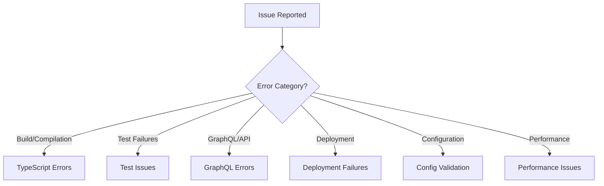

# CLAUDE.md - Saleor Configurator Development Guide

This document contains important conventions, implementation details, design decisions, and memories for the Saleor Configurator project to assist Claude Code in understanding and working with the codebase.

## Table of Contents

### Quick Reference
- [Entity Quick Reference](#entity-quick-reference)
- [Quick Command Reference](#quick-command-reference)
- [Mandatory Pre-Push Checklist](#mandatory-pre-push-checklist)
- [End-to-End Testing Protocol](#mandatory-end-to-end-cli-testing-protocol)

### Project Overview & Architecture
- [Project Overview](#project-overview)
- [Architecture & Design Decisions](#architecture--design-decisions)
- [Technology Stack](#technology-stack)
- [MCP Tool Integration](#mcp-tool-integration)

### Development Guidelines
- [Development Guidelines](#development-guidelines)
- [Entity Identification Guidelines](#entity-identification-guidelines)
- [Common Pitfalls to Avoid](#critical-common-pitfalls-to-avoid)
- [Development Workflows](#development-workflows)

### Core Systems
- [Error Handling System](#error-handling-system)
- [CLI Framework](#cli-framework)
- [GraphQL Integration](#graphql-integration)
- [Configuration System](#configuration-system)
- [Deployment Pipeline Architecture](#deployment-pipeline-architecture)

### Testing & Quality
- [Testing Strategy](#testing-strategy)
- [Testing Requirements](#testing-requirements)
- [Performance Guidelines](#performance-guidelines)

### Advanced Topics
- [Context & Memory Management](#context--memory-management)
- [Task Planning Patterns](#task-planning-patterns)
- [Communication Patterns](#communication-patterns)
- [Troubleshooting Decision Tree](#troubleshooting-decision-tree)
- [Error Recovery Procedures](#error-recovery-procedures)
- [Security Patterns](#security-patterns)
- [Service Architecture Deep Dive](#service-architecture-deep-dive)

### Release & Maintenance
- [Release Management](#release-management)
- [Documentation Maintenance](#documentation-maintenance)
- [Common Issues & Solutions](#common-issues--solutions)

## Project Overview

**Saleor Configurator** is a "commerce as code" CLI tool that enables declarative configuration management for Saleor e-commerce platforms. It allows developers to define their entire Saleor configuration in YAML files and synchronize it with their Saleor instances.

**Key Capabilities:**

- **Push**: Apply local configuration to remote Saleor instance
- **Introspect**: Download remote configuration to local YAML files
- **Diff**: Compare local and remote configurations
- **Start**: Interactive wizard for first-time setup

## Architecture & Design Decisions

### Core Architecture

The project follows a **service-oriented architecture** with clear separation of concerns:

```
src/
├── cli/           # CLI framework and user interaction
├── commands/      # Individual CLI commands (push, introspect, diff, start)
├── core/          # Core business logic and orchestration
├── lib/           # Shared utilities and infrastructure
└── modules/       # Domain-specific modules (product, category, etc.)
```

**Key Design Patterns:**

- **Dependency Injection**: ServiceContainer pattern for loose coupling
- **Repository Pattern**: Data access abstraction with GraphQL
- **Command Pattern**: CLI commands as discrete handlers
- **Strategy Pattern**: Multiple comparators for diff operations
- **Factory Pattern**: Service composition and client creation

### Technology Stack

**Runtime & Build:**

- **TypeScript**: Full type safety with strict configuration
- **Node.js 20+**: Modern runtime with ES modules
- **pnpm**: Package manager with workspace support
- **Biome**: Linting and formatting (replaces ESLint + Prettier)

**Core Dependencies:**

- **Commander.js**: CLI framework with TypeScript support
- **URQL**: GraphQL client with caching and auth
- **Zod**: Schema validation and type inference
- **gql.tada**: GraphQL TypeScript codegen
- **tslog**: Structured logging
- **YAML**: Configuration file parsing

## Error Handling System

### Error Hierarchy

The project uses a comprehensive error system with domain-specific error types:

```typescript
BaseError (abstract)
├── EnvironmentVariableError
├── ZodValidationError
├── GraphQLError
│   └── GraphQLUnknownError
├── CliError
│   ├── CliArgumentError
│   ├── CliValidationError
│   └── CliFileError
└── Domain-specific errors (DiffError, AttributeError, etc.)
```

### Error Handling Conventions

**1. Always extend BaseError for custom errors**

```typescript
export class MyDomainError extends BaseError {
  constructor(message: string) {
    super(message, "MY_DOMAIN_ERROR");
  }
}
```

**2. Use GraphQLError.fromCombinedError() for GraphQL errors**

- Automatically detects permission errors, network issues, etc.
- Provides context-aware error messages with helpful advice
- Handles GraphQL errors vs HTTP status codes correctly

**3. Use ZodValidationError.fromZodError() for validation errors**

- Formats Zod validation issues into user-friendly messages
- Includes field paths and specific error types

**4. Domain-specific errors should be co-located**

- Each module has its own `errors.ts` file
- Errors are grouped by domain (CLI, diff, attribute, etc.)

## CLI Framework

### Command Structure

All commands follow a standardized pattern using a `CommandConfig` interface:

```typescript
interface CommandConfig<T extends z.ZodObject<Record<string, z.ZodTypeAny>>> {
  name: string;
  description: string;
  schema: T; // Zod schema for validation
  handler: (args: z.infer<T>) => Promise<void>;
  examples?: string[]; // CLI help examples
  requiresInteractive?: boolean; // Interactive mode support
}
```

### Command Development Conventions

**1. Schema-First Design**

- Define Zod schema first, then implement handler
- Schema doubles as validation and Commander.js option generation
- Extend `baseCommandArgsSchema` for common options

**2. Interactive Argument Resolution**

- Use `maybePromptForUrl()` and `maybePromptForToken()` for missing args
- Always confirm destructive operations with `confirmAction()`
- Provide clear progress indication for long-running operations

**3. Error Handling in Commands**

- Let errors bubble up to global handler
- Use structured logging for debugging
- Provide actionable error messages to users

## GraphQL Integration

### Schema Management

**Schema Source**: Uses versioned Saleor schemas from GitHub

- Version controlled via `package.json` saleor.schemaVersion
- Automatically fetched on `postinstall` hook
- Generates TypeScript types with gql.tada

**Type Generation**: Uses gql.tada for end-to-end type safety

- GraphQL operations are fully typed
- Schema introspection generates `graphql-env.d.ts`
- TypeScript plugin provides IDE integration

### GraphQL Client Configuration

**Client Setup**: Uses URQL with auth exchange

- Bearer token authentication
- Network-only request policy (no caching)
- Automatic auth error detection

**Repository Pattern**: Each domain has a repository for GraphQL operations

- Encapsulates all GraphQL queries/mutations
- Provides type-safe interfaces
- Handles errors with `GraphQLError.fromCombinedError()`

## Configuration System

### Configuration Format

**YAML-Based Configuration**: Declarative configuration files

- Human-readable and version-controllable
- Supports nested structures and references
- Example configuration in `example.yml`

**Schema Definition**: Zod schemas define configuration structure

- Located in `src/modules/config/schema/`
- Provides validation and TypeScript types
- Auto-generates documentation

### Configuration Sections

**Supported Entities:**

- **shop**: Global shop settings
- **channels**: Sales channels with country/currency
- **productTypes**: Product type definitions with attributes
- **pageTypes**: Page type definitions
- **categories**: Category hierarchy
- **products**: Product catalog (reference implementation)
- **collections**: Product collections with channel listings
- **menus**: Hierarchical navigation menus
- **models**: Pages with attributes (mapped to Saleor Pages)
- **taxClasses**: Tax rates and configurations
- **warehouses**: Inventory management locations
- **shippingZones**: Shipping configuration zones

**Attribute System**: Flexible attribute definitions

- Support for various input types (text, dropdown, reference, etc.)
- Reusable attributes across product/page types
- Reference existing attributes or create new ones

## Testing Strategy

### Test Organization

**Test Types:**

- **Unit Tests**: Individual service and utility testing
- **Integration Tests**: End-to-end command testing
- **Schema Tests**: Configuration validation testing

**Test Patterns:**

- Tests are co-located with source files
- Use descriptive test names with business context
- Mock external dependencies (GraphQL client, file system)

### Testing Conventions

**1. Test File Naming**

- `*.test.ts` for unit tests
- `*.integration.test.ts` for integration tests
- `*.selective.test.ts` for selective operation tests

**2. Test Setup**

- Global setup in `src/lib/test-setup.ts`
- Environment configuration for test runs
- Structured logging disabled in tests

**3. Mocking Strategy**

- Mock GraphQL client for repository tests
- Mock file system for configuration tests
- Use real validation for schema tests

**4. TypeScript Best Practices in Tests**

**CRITICAL**: Always use actual service types from imports instead of `as any` or creating mock interfaces:

**Entity Testing Patterns**

Each entity service must include comprehensive test coverage:

1. **Validation Scenarios**: Test both valid and invalid input configurations
2. **Bootstrap Operations**: Verify entity creation and initialization 
3. **Update Operations**: Test modification of existing entities (where applicable)
4. **Error Handling**: Test all error scenarios with proper error types
5. **Service Dependencies**: Mock all dependency services with actual types
6. **Cross-Entity References**: Test entity relationships and references

**Required Test Structure for Each Entity:**
```typescript
describe("EntityService", () => {
  describe("validateEntityInput", () => {
    // Test validation scenarios
  });
  
  describe("bootstrapEntities", () => {
    // Test entity creation scenarios
  });
  
  describe("error handling", () => {
    // Test ServiceErrorWrapper integration
  });
});
```

**Integration Test Requirements:**
1. Round-trip integrity testing (introspect → deploy → introspect)
2. Cross-entity reference validation
3. Selective operations testing (--include/--exclude flags)
4. Idempotency verification (deploy twice with same config)

**Mock Service Dependencies:**

```typescript
// ✅ CORRECT: Import and use actual service types
import { ProductService } from "../product/product-service";
import { ChannelService } from "../channel/channel-service";

const mockProductService = {
  getAllProducts: vi.fn(),
  getProductBySlug: vi.fn(),
} as unknown as ProductService;

const mockChannelService = {
  getAllChannels: vi.fn(),
  getChannelBySlug: vi.fn(), 
} as unknown as ChannelService;
```

```typescript
// ❌ INCORRECT: Using as any or creating mock interfaces
const mockProductService = {
  getAllProducts: vi.fn(),
} as any; // Avoid this

// ❌ INCORRECT: Creating unnecessary mock interfaces
interface MockProductService {
  getAllProducts: ReturnType<typeof vi.fn>;
}
```

**Key Principles:**
- Always import actual service classes and use them as types
- Use `as unknown as ServiceType` for proper type casting
- Maintain vi.fn() mocking pattern with real service type safety
- This ensures better type safety, IntelliSense support, and prevents breaking changes

## Development Workflow

### Scripts and Commands

**Development:**

- `pnpm dev`: Run CLI with tsx for development
- `pnpm build`: TypeScript compilation
- `pnpm test`: Run test suite with Vitest

**Code Quality:**

- `pnpm lint`: Biome linting
- `pnpm format`: Biome formatting
- `pnpm check`: Combined linting and formatting

**Schema Management:**

- `pnpm fetch-schema`: Download Saleor GraphQL schema
- `pnpm generate-docs`: Generate schema documentation

### Code Quality Standards

**Biome Configuration**: Strict linting and formatting rules

- 100 character line width
- 2-space indentation
- Double quotes for strings
- Trailing commas for ES5 compatibility

**TypeScript Configuration**: Strict type checking

- No unused locals/parameters allowed
- Strict null checks enabled
- gql.tada plugin for GraphQL types
- **NEVER use `as any` in production code** - only allowed in test files for mocking
- Use proper type guards, union types, or generic constraints instead

## MCP Tool Integration

### Available MCP Servers

**Serena MCP**: Semantic code analysis and file operations
- Provides symbolic code exploration capabilities
- Enables efficient code navigation without reading entire files
- Supports pattern searching across the codebase

**Context7 MCP**: Library documentation retrieval
- Resolves library IDs and fetches up-to-date documentation
- Provides code examples and API references
- Eliminates need for manual documentation searches

### Tool Selection Guide

**For Code Exploration:**
1. **First**: Use Serena's `get_symbols_overview` for file understanding
2. **Then**: Use `find_symbol` for specific symbols with proper name_path
3. **Last Resort**: Use Read tool only when absolutely necessary

**For Searching:**
1. **Code symbols**: Use Serena's `find_symbol` with proper name_path matching
2. **Pattern search**: Use Serena's `search_for_pattern` for flexible regex searches
3. **File finding**: Use Serena's `find_file` for filename-based searches
4. **AVOID**: Using Bash grep/find commands - always prefer Serena tools

**For Library Documentation:**
1. **Always**: Use Context7's `resolve-library-id` to get proper library ID
2. **Then**: Use `get-library-docs` with resolved ID for documentation
3. **AVOID**: Manual web searches or outdated documentation

## Entity Quick Reference

| Entity | Identifier | Repository | Service | Comparator |
|--------|------------|------------|---------|------------|
| Shop | singleton | ShopOperations | ShopService | ShopComparator |
| Channels | slug | ChannelOperations | ChannelService | ChannelComparator |
| Categories | slug | CategoryOperations | CategoryService | CategoryComparator |
| Collections | slug | CollectionOperations | CollectionService | CollectionComparator |
| Menus | slug | MenuOperations | MenuService | MenuComparator |
| Models/Pages | slug | ModelOperations | ModelService | ModelComparator |
| Products | slug | ProductOperations | ProductService | ProductComparator |
| ProductTypes | name | ProductTypeOperations | ProductTypeService | ProductTypeComparator |
| PageTypes | name | PageTypeOperations | PageTypeService | PageTypeComparator |
| TaxClasses | name | TaxOperations | TaxService | TaxClassComparator |
| Warehouses | slug | WarehouseOperations | WarehouseService | WarehouseComparator |
| ShippingZones | name | ShippingZoneOperations | ShippingZoneService | ShippingZoneComparator |
| Attributes | name | AttributeOperations | AttributeService | - |

## Memory & Implementation Details

### Important Patterns

**1. Service Container Pattern**

- All services are registered in `ServiceContainer`
- Dependencies are injected via constructor
- Services are composed in `ServiceComposer`

**2. Selective Operations**

- Use `--include` and `--exclude` flags for selective operations
- Implemented via `SelectiveOptions` utility
- Supports section-based filtering

**3. Diff System**

- Specialized comparators for different entity types
- Multiple output formats (table, JSON, YAML)
- Supports both introspect and push perspectives

### Configuration Validation

**1. Multi-Layer Validation**

- Zod schemas for structure validation
- Business logic validation in services
- GraphQL schema validation on push

**2. Error Context**

- Validation errors include field paths
- Custom error formatters for Zod issues
- Helpful suggestions for common errors

### Performance Guidelines

**GraphQL Optimization Strategies**
- Use selective field queries to minimize payload size
- Implement pagination for large datasets (products, categories)
- Batch operations where Saleor API supports it
- Use network-only policy to avoid URQL cache issues
- Implement connection pooling for high-throughput scenarios

**MCP Tool Usage for Performance**
- Prefer Serena's symbolic tools over full file reading
- Use `get_symbols_overview` before diving into specific symbols
- Leverage `search_for_pattern` for targeted searches vs full codebase scans
- Cache frequently accessed data in Serena memories
- Use Context7 for library docs instead of expensive web searches

**Development Performance**
- Use `tsx` for fast TypeScript execution in development
- Leverage Biome's fast linting/formatting vs slower alternatives  
- Run tests selectively during development: `pnpm test src/modules/specific/`
- Use `--include` flags for focused operations during testing

**Deployment Optimizations**
- Use `--ci` flag for automated environments (skips confirmations)
- Implement progressive deployment for large configuration changes
- Use `--dry-run` for validation without actual deployment
- Leverage selective deployment with `--include`/`--exclude` flags

**File Operations Performance**
- Stream large configuration files instead of loading entirely
- Create atomic backups before destructive operations
- Use efficient YAML parsing with proper error boundaries
- Implement file watching for development workflows

## Release Management

### Version Control

**Changesets**: Uses changesets for version management

- Create changesets with `pnpm changeset`
- Automatic changelog generation
- GitHub releases with proper tag creation

**Writing Changesets**:

When creating or updating a changeset for a branch:

1. **Review Everything**: Thoroughly review all changes made on the current branch
2. **Find the Right Changeset**: Look for the changeset file that contains `"@saleor/configurator": patch` (or minor/major) - this is the one to edit
3. **Don't Edit Other Changesets**: Other changeset files are ready for merge/publish - do not modify them
4. **Write for NPM Users**: The changeset will appear in the npm package changelog, so write for engineers who will read it

**Changeset Content Guidelines**:
- **Be Concise**: Summarize the change in 1-2 sentences
- **Be Pragmatic**: Focus on what changed and why it matters to users
- **Be Human Readable**: Avoid technical jargon, use clear language
- **Include Impact**: Mention if it fixes bugs, adds features, or changes behavior

**Example Changeset**:
```markdown
---
"@saleor/configurator": patch
---

Fixed entity identification to use slugs instead of names for categories and channels. This resolves issues where entities with the same name but different slugs were incorrectly treated as duplicates.
```

**Release Process**:

1. Create changeset for changes
2. Merge changeset PR to main
3. Automatic GitHub release creation
4. Tags pushed with `git push --follow-tags`

### CI/CD

**GitHub Actions**: Automated testing and releases

- Release workflow triggered on main branch
- Fetches tags before changeset processing
- Creates GitHub releases with proper versioning

## MANDATORY PRE-PUSH CHECKLIST

⚠️ **CRITICAL**: NEVER push changes unless ALL of these pass in order:

```bash
# 1. Auto-fix all linting and formatting issues
pnpm check:fix

# 2. Verify TypeScript compilation
pnpm build

# 3. Run all tests
pnpm test

# 4. Verify TypeScript with strict checking
npx tsc --noEmit

# 5. Final validation check
pnpm check:ci
```

**This checklist is MANDATORY and cannot be bypassed for any reason.**

## Development Guidelines

### Entity Identification Guidelines

**IMPORTANT**: All entities that have slugs in the Saleor API must use slugs as their primary identifier for comparisons and uniqueness validation.

#### Current Entity Identification:
- **Categories**: Use `slug` for identification (required field)
- **Channels**: Use `slug` for identification (required field)  
- **Collections**: Use `slug` for identification (required field)
- **Menus**: Use `slug` for identification (required field)
- **Models/Pages**: Use `slug` for identification (required field)
- **Products**: Use `slug` for identification (required field)
- **Warehouses**: Use `slug` for identification (required field)
- **Page Types**: Use `name` for identification (no slug in API)
- **Product Types**: Use `name` for identification (no slug in API)
- **Tax Classes**: Use `name` for identification (no slug in API)
- **Shipping Zones**: Use `name` for identification (no slug in API)
- **Attributes**: Use `name` for identification (no slug in API)

#### Implementation Requirements:
1. **Schema Definition**: If an entity has a slug in the API, the schema MUST include it as a required field
2. **Comparator Implementation**: The `getEntityName()` method must return the slug for slug-based entities
3. **Validation**: Use `validateUniqueIdentifiers()` which validates based on the identifier returned by `getEntityName()`
4. **Subcategory/Nested Handling**: Use slug-based maps for comparison when entities have slugs

#### Example Implementation:
```typescript
// Schema with slug
const entitySchema = z.object({
  name: z.string().describe("Entity.name"),
  slug: z.string().describe("Entity.slug"),
});

// Comparator using slug
protected getEntityName(entity: Entity): string {
  if (!entity.slug) {
    throw new EntityValidationError("Entity must have a valid slug");
  }
  return entity.slug;
}
```

This approach ensures entities with the same name but different slugs are correctly treated as separate entities, preventing false duplicate detection errors.

## CRITICAL: Common Pitfalls to Avoid

### Never Do This:
- ❌ Push without running the mandatory pre-push checklist
- ❌ Use `as any` in production code (only allowed in test files with proper typing)
- ❌ Create mock interfaces when actual service types exist
- ❌ Use Bash find/grep instead of Serena MCP tools
- ❌ Read entire files when Serena's symbolic tools would suffice
- ❌ Assume libraries exist without checking package.json first
- ❌ Skip error handling with ServiceErrorWrapper pattern
- ❌ Use names for entity identification when slugs are available
- ❌ Bypass the end-to-end testing protocol for core changes

### Always Do This:
- ✅ Import actual service types in tests: `import { ProductService } from "../product/product-service"`
- ✅ Use `as unknown as ServiceType` for proper type casting in tests
- ✅ Use slug-based identification for entities that support it
- ✅ Extend BaseError for all custom error types
- ✅ Use Serena MCP tools for code exploration and searching
- ✅ Check existing patterns and conventions before implementing
- ✅ Follow the service-oriented architecture patterns
- ✅ Use ServiceErrorWrapper for consistent error handling across services

## Deployment Pipeline Architecture

### Pipeline Stages (Sequential)
The deployment system follows a multi-stage approach with comprehensive error handling:

1. **Validation Stage**: 
   - Schema validation using Zod
   - Configuration consistency checks
   - Entity relationship validation
   - Pre-deployment safety checks

2. **Preparation Stage**: 
   - Entity resolution and dependency mapping
   - Execution order determination
   - Resource allocation and batching
   - Rollback preparation

3. **Execution Stage**: 
   - Sequential entity deployment
   - Progress tracking with metrics
   - Real-time error detection
   - Partial rollback on failures

4. **Verification Stage**: 
   - Post-deployment validation
   - Entity relationship verification
   - Configuration consistency confirmation
   - Success/failure reporting

### Error Recovery and Rollback
- Each stage maintains rollback capability
- Progress is tracked with detailed metrics
- Failed deployments provide actionable error messages with recovery suggestions
- Partial deployments can be resumed from failure point

## Development Workflows

### Adding New Entity Support
Follow this systematic approach for adding new entity types:

1. **Schema Definition**: Create schema in `src/modules/config/schema/`
   - Define Zod schema with proper validation rules
   - Include slug field if entity supports it in Saleor API
   - Add to main schema in `schema.ts`

2. **Module Implementation**: Create module directory structure
   ```
   src/modules/new-entity/
   ├── repository.ts      # GraphQL operations
   ├── service.ts         # Business logic
   ├── errors.ts          # Entity-specific errors
   └── service.test.ts    # Comprehensive tests
   ```

3. **Service Container Integration**: 
   - Add to `ServiceContainer` interface
   - Register in `ServiceComposer`
   - Wire up dependencies

4. **Comparator Implementation**: Create in `src/core/diff/comparators/`
   - Extend `BaseComparator`
   - Implement `getEntityName()` method (use slug if available)
   - Add to comparator index

5. **Testing Requirements**: 
   - Unit tests for service with all scenarios
   - Integration tests for cross-entity references
   - End-to-end CLI testing protocol

6. **Documentation Update**: 
   - Add to entity quick reference table
   - Update supported entities list
   - Document any special considerations

### Debugging Failed Deployments
Systematic approach to diagnosing deployment issues:

1. **Enable Debug Logging**:
   ```bash
   LOG_LEVEL=debug pnpm dev deploy --url=$TEST_URL --token=$TEST_TOKEN
   ```

2. **Check Deployment Pipeline Stages**:
   - Review validation stage output
   - Check preparation stage entity ordering
   - Monitor execution stage progress
   - Verify verification stage results

3. **Analyze Specific Issues**:
   ```bash
   # Check GraphQL permissions
   pnpm dev diff --url=$TEST_URL --token=$TEST_TOKEN
   
   # Test specific entity deployments
   pnpm dev deploy --url=$TEST_URL --token=$TEST_TOKEN --include=collections
   
   # Dry run to preview changes
   pnpm dev deploy --url=$TEST_URL --token=$TEST_TOKEN --dry-run
   ```

4. **Common Failure Scenarios**:
   - **Permission Errors**: Check app token permissions in Saleor dashboard
   - **Entity References**: Verify cross-entity relationships exist
   - **Schema Validation**: Check Zod validation error details
   - **Network Issues**: Retry with exponential backoff

### Adding New Commands

1. Create command file in `src/commands/`
2. Define Zod schema extending `baseCommandArgsSchema`
3. Implement handler function with proper error handling
4. Add command to `src/commands/index.ts` registry
5. Include examples in command configuration

### Adding New Modules

1. Create module directory in `src/modules/`
2. Implement service, repository, and error classes
3. Add module to service container
4. Update configuration schema if needed
5. Add comprehensive tests

### Error Handling Best Practices

1. Always use typed errors extending `BaseError`
2. Provide actionable error messages
3. Include context and suggestions where helpful
4. Use structured logging for debugging
5. Handle GraphQL errors with `GraphQLError.fromCombinedError()`

## Testing Requirements

### MANDATORY END-TO-END CLI TESTING PROTOCOL

**When Required**: This protocol is MANDATORY for:
- Any core functionality changes
- New entity type support  
- Changes to comparators or diff logic
- Modifications to deployment pipeline
- Changes to introspect/deploy commands

**Test Environment Credentials**:
```bash
TEST_URL="https://store-rzalldyg.saleor.cloud/graphql/"
TEST_TOKEN="YbE8g7ZNl0HkxdK92pfNdLJVQwV0Xs"
```

### Step-by-Step Testing Protocol

#### Phase 1: Clean Introspect
```bash
# Remove any existing configuration
rm -f config.yml

# Introspect fresh configuration from test instance
pnpm dev introspect --url=$TEST_URL --token=$TEST_TOKEN

# Verify introspection succeeded
cat config.yml | head -20
```

#### Phase 2: Modify Configuration
Make appropriate changes based on the feature being tested:

**Collections Test Example**:
```yaml
# Add to config.yml after introspect
collections:
  - name: "Test Collection"
    slug: "test-collection"
    products:
      - "existing-product-slug"
    channelListings:
      - channel: "default-channel"
        isPublished: true
```

**Menus Test Example**:
```yaml  
# Add to config.yml after introspect
menus:
  - name: "Test Menu"
    slug: "test-menu"
    items:
      - name: "Parent Item"
        url: "/"
        children:
          - name: "Child Item"
            category: "existing-category-slug"
```

**Models/Pages Test Example**:
```yaml
# Add to config.yml after introspect  
models:
  - title: "Test Page"
    slug: "test-page"
    pageType: "existing-page-type"
    isPublished: true
    attributes:
      - attribute: "content"
        values: ["Test content"]
```

#### Phase 3: First Deployment
```bash
# Deploy changes to test instance
pnpm dev deploy --url=$TEST_URL --token=$TEST_TOKEN

# Verify deployment succeeded - check for errors/warnings
```

#### Phase 4: Idempotency Test (CRITICAL)
```bash  
# Deploy again WITHOUT any changes
# This MUST not create any diff or changes
pnpm dev deploy --url=$TEST_URL --token=$TEST_TOKEN

# Expected output: "No changes to deploy"
# If any changes are detected, there's an idempotency issue
```

#### Phase 5: Round-Trip Verification
```bash
# Remove local configuration  
rm -f config.yml

# Introspect again to verify changes persisted
pnpm dev introspect --url=$TEST_URL --token=$TEST_TOKEN

# Diff should show NO changes
pnpm dev diff --url=$TEST_URL --token=$TEST_TOKEN

# Expected output: "No differences found"  
```

### Validation Checklist
After completing all phases, verify:
- [ ] No errors during any operation
- [ ] Idempotency test shows no changes
- [ ] Round-trip maintains exact configuration  
- [ ] All entity relationships preserved
- [ ] No orphaned entities created
- [ ] No data loss occurred

### Common Issues to Check
1. **Slug vs Name Identification**: Ensure entities using slugs are compared correctly
2. **Nested Structures**: Categories and menus maintain hierarchy
3. **Cross-Entity References**: Products in collections, categories in menus
4. **Channel Listings**: Proper channel assignment preservation
5. **Attribute Values**: Complex attributes maintain their values

### Debug Commands for Issues
```bash
# Enable debug logging
LOG_LEVEL=debug pnpm dev deploy --url=$TEST_URL --token=$TEST_TOKEN

# Check specific entity diff
pnpm dev diff --url=$TEST_URL --token=$TEST_TOKEN --include=collections

# Dry run to see what would be deployed
pnpm dev deploy --url=$TEST_URL --token=$TEST_TOKEN --dry-run
```

**CRITICAL REMINDERS**:
- ⚠️ **NEVER** skip this protocol for core changes
- ⚠️ **ALWAYS** test idempotency (deploy twice)  
- ⚠️ **ALWAYS** verify round-trip integrity
- ⚠️ **NEVER** push if any phase fails

### Unit Test Requirements

## Common Issues & Solutions

### GraphQL Error Handling

**Issue**: GraphQL returns HTTP 200 even for permission errors
**Solution**: Check `graphQLErrors` array, not HTTP status codes

**Issue**: URQL auth errors not properly detected
**Solution**: Use `extensions.exception.code` for permission detection

### Configuration Validation

**Issue**: Complex nested validation errors
**Solution**: Use `ZodValidationError.fromZodError()` for formatting

**Issue**: Schema changes breaking existing configs
**Solution**: Use schema versioning and migration strategies

### CLI User Experience

**Issue**: Commands failing silently
**Solution**: Comprehensive error handling with exit codes

**Issue**: Missing required arguments
**Solution**: Interactive prompts with `maybePromptFor*()` functions

## Quick Command Reference

### Development Commands
```bash
# Development with different commands
pnpm dev                              # Interactive CLI
pnpm dev start                        # Interactive wizard
pnpm dev introspect --url=$URL --token=$TOKEN
pnpm dev diff --url=$URL --token=$TOKEN  
pnpm dev deploy --url=$URL --token=$TOKEN

# With custom config files
pnpm dev introspect --config=custom.yml --url=$URL --token=$TOKEN
pnpm dev deploy --config=production.yml --url=$URL --token=$TOKEN

# Selective operations
pnpm dev deploy --url=$URL --token=$TOKEN --include=collections,menus
pnpm dev diff --url=$URL --token=$TOKEN --exclude=products,categories
```

### Quality Assurance Commands
```bash
# Mandatory pre-push checklist (run in order)
pnpm check:fix                       # Auto-fix issues
pnpm build                          # Verify compilation
pnpm test                           # Run all tests  
npx tsc --noEmit                    # TypeScript check
pnpm check:ci                       # Final validation

# Individual quality checks
pnpm lint                           # Biome linting only
pnpm format                         # Biome formatting only
pnpm check                          # Combined check without fixes
```

### Testing Commands
```bash
# Test execution
pnpm test                           # All tests
pnpm test:ci                        # CI mode (silent)
CI=true pnpm test                   # Alternative CI mode

# Selective testing
pnpm test src/modules/collection/    # Specific module
pnpm test src/core/diff/            # Core functionality
pnpm test --run                     # Run once (no watch)
```

### Schema and Build Commands  
```bash
# Schema management
pnpm fetch-schema                   # Download Saleor GraphQL schema
pnpm generate-json-schema           # Generate JSON schema
pnpm generate-schema-docs           # Generate SCHEMA.md

# Build and release
pnpm build                          # TypeScript compilation
pnpm changeset                      # Create changeset
pnpm version                        # Apply changesets
```

### Debug Commands
```bash
# Debug deployment issues
LOG_LEVEL=debug pnpm dev deploy --url=$URL --token=$TOKEN
LOG_LEVEL=debug pnpm dev diff --url=$URL --token=$TOKEN

# Test environment (always available)
TEST_URL="https://store-rzalldyg.saleor.cloud/graphql/"
TEST_TOKEN="YbE8g7ZNl0HkxdK92pfNdLJVQwV0Xs"
```

### Git and Release Commands
```bash
# Standard git workflow
git status
git add .
git commit -m "feat: description"
git push

# Release workflow  
pnpm changeset                      # Create changeset
git add .changeset/
git commit -m "chore: add changeset"
git push
```

## Context & Memory Management

### Serena Memory Strategy
Serena MCP provides persistent memory capabilities that should be used strategically:

**When to Use Serena Memories:**
- Project architecture overviews that don't change frequently
- Common development patterns and conventions
- Frequently referenced code snippets and configurations
- Troubleshooting procedures and solutions

**When to Use Inline Documentation:**
- Specific implementation details that may change
- Version-dependent information
- Context-specific instructions
- Dynamic configuration values

**Memory Organization Patterns:**
```markdown
project_overview.md      # High-level architecture and purpose
code_conventions.md      # Coding standards and patterns  
common_workflows.md      # Frequent development procedures
troubleshooting_guide.md # Known issues and solutions
entity_patterns.md       # Service/Repository/Comparator patterns
```

**Context Window Optimization:**
- Use Serena's `get_symbols_overview` before reading full files
- Leverage `find_symbol` with specific name paths to reduce context usage
- Store frequently needed information in memories rather than re-reading
- Use `search_for_pattern` for targeted searches vs full file reads

### Information Retrieval Strategy
**Hierarchical Information Access:**
1. Check Serena memories first for established patterns
2. Use symbolic tools for code exploration
3. Read specific files only when necessary
4. Use pattern search for cross-file analysis

**Memory Persistence Across Conversations:**
- Update memories when architectural changes occur
- Validate memory accuracy periodically
- Use consistent naming conventions for easy retrieval
- Cross-reference memories with inline documentation

## Task Planning Patterns

### TodoWrite Usage Guidelines

**Required TodoWrite Scenarios:**
- Any multi-step feature implementation (3+ distinct steps)
- Complex tasks requiring multiple file modifications
- Cross-entity changes affecting multiple services
- Testing protocols with multiple validation phases
- Debugging procedures with systematic steps

**Optional TodoWrite Scenarios:**
- Single-file modifications
- Simple configuration changes
- Documentation-only updates
- One-step operations

**Task Breakdown Strategies:**

**Feature Implementation Pattern:**
```markdown
1. Research and understand requirements
2. Design schema/interface changes
3. Implement core functionality
4. Add comprehensive tests
5. Run pre-push validation checklist
6. Execute end-to-end testing protocol
```

**Bug Fix Pattern:**
```markdown
1. Reproduce the issue
2. Identify root cause
3. Design solution approach
4. Implement fix with tests
5. Verify fix with affected scenarios
6. Run validation checklist
```

**Entity Addition Pattern:**
```markdown
1. Schema definition and validation
2. Repository implementation
3. Service layer with error handling
4. Comparator implementation
5. Service container integration
6. Comprehensive test suite
7. End-to-end CLI testing
8. Documentation updates
```

**Task Completion Validation:**
- Mark tasks complete only when fully accomplished
- Create follow-up tasks for discovered issues
- Maintain exactly ONE task as in_progress at any time
- Update task descriptions if scope changes

### Parallel vs Sequential Execution
**Parallel Tasks (Independent):**
- Multiple file modifications that don't depend on each other
- Separate test suites for different modules
- Documentation updates across different sections
- Code exploration in different parts of codebase

**Sequential Tasks (Dependent):**
- Schema changes → Service implementation → Tests
- Core changes → Comparator updates → Integration testing
- Implementation → Validation → Documentation

## Communication Patterns

### Verbosity Guidelines

**Be Concise For:**
- Straightforward operations with clear outcomes
- Routine maintenance tasks
- Simple configuration changes
- Standard validation procedures

**Be Verbose For:**
- Complex architectural decisions
- Error diagnosis and troubleshooting
- First-time entity implementations
- Breaking changes or major modifications
- Security-sensitive operations

**Progress Reporting Standards:**
```markdown
# Long Operations (>30 seconds expected)
- Report phase transitions: "Starting validation phase..."
- Indicate progress milestones: "Completed 3/5 entities..."
- Provide context for delays: "Waiting for GraphQL response..."

# Error Scenarios
- State what failed clearly
- Explain probable cause
- Provide concrete next steps
- Reference relevant troubleshooting sections
```

**Error Explanation Strategies:**

**Technical Errors (for developers):**
- Include stack traces when relevant
- Reference specific file paths and line numbers
- Provide GraphQL query details
- Include environment context

**User-Friendly Errors (for operators):**
- Plain English problem description
- Actionable resolution steps
- References to documentation sections
- Alternative approaches when available

### Question vs Assumption Guidelines

**Ask Clarifying Questions When:**
- Multiple valid implementation approaches exist
- User intent is ambiguous
- Security implications are unclear
- Breaking changes might be involved
- Configuration affects production systems

**Make Reasonable Assumptions When:**
- Following established project patterns
- Using documented conventions
- Implementing standard CRUD operations
- Following existing entity patterns
- Applying known best practices

**Assumption Documentation Pattern:**
```markdown
"I'm implementing this using the standard service pattern 
established for other entities. If you need a different approach, 
please let me know."
```

## Troubleshooting Decision Tree

### Systematic Problem Diagnosis

**Step 1: Identify Problem Category**


### GraphQL Error Resolution Tree
```
GraphQL Error
├── Authentication (401/403)
│   ├── Check token validity in Saleor dashboard
│   ├── Verify app permissions (all permissions required)
│   └── Test with: pnpm dev diff --url=$URL --token=$TOKEN
├── Network Issues (5xx, timeouts)
│   ├── Check Saleor instance availability
│   ├── Verify URL format (must end with /graphql/)
│   └── Test connectivity: curl -I $URL
├── Schema Validation (400)
│   ├── Check Saleor version compatibility (3.20+)
│   ├── Run: pnpm fetch-schema
│   └── Verify GraphQL query syntax
└── Permission Errors (specific operations)
    ├── Check entity-specific permissions
    ├── Verify app has manage permissions
    └── Test with minimal configuration
```

### Deployment Failure Resolution Tree
```
Deployment Failure
├── Validation Stage Failure
│   ├── Schema validation errors → Check Zod schema definitions
│   ├── Entity relationship errors → Verify cross-entity references
│   └── Configuration format errors → Validate YAML syntax
├── Preparation Stage Failure
│   ├── Dependency resolution errors → Check entity dependencies
│   ├── Execution order issues → Review entity relationships
│   └── Resource allocation errors → Check GraphQL complexity
├── Execution Stage Failure
│   ├── GraphQL mutation errors → Check individual entity operations
│   ├── Transaction failures → Review batch operations
│   └── Rollback triggered → Analyze partial deployment state
└── Verification Stage Failure
    ├── Entity state inconsistency → Manual verification required
    ├── Relationship validation errors → Check cross-entity references
    └── Configuration mismatch → Run introspect to compare
```

### Test Failure Resolution Tree
```
Test Failure
├── Unit Test Failures
│   ├── Mock Interface Errors → Use actual service types
│   ├── Service Dependency Issues → Check service container mocks
│   └── Validation Logic Errors → Review business rules
├── Integration Test Failures
│   ├── Cross-Entity Reference Errors → Check entity relationships
│   ├── Configuration Validation Errors → Review schema definitions
│   └── End-to-End Flow Issues → Check complete workflows
├── TypeScript Compilation Errors
│   ├── Type Safety Issues → Remove `as any` usage
│   ├── Import/Export Errors → Check module paths
│   └── Generic Constraint Errors → Review type definitions
└── Biome Linting Errors
    ├── Code Style Issues → Run: pnpm check:fix
    ├── Unused Import Errors → Clean up imports
    └── No Explicit Any Errors → Use proper types
```

### Performance Issue Resolution Tree
```
Performance Issues
├── GraphQL Query Performance
│   ├── Large payload → Use selective field queries
│   ├── N+1 queries → Implement batching
│   └── Timeout errors → Add pagination
├── Memory Usage
│   ├── Context window overflow → Use Serena symbolic tools
│   ├── Large file processing → Implement streaming
│   └── Memory leaks → Review async operations
├── Development Performance
│   ├── Slow test execution → Use selective testing
│   ├── Build performance → Check TypeScript configuration
│   └── Tool performance → Prefer Serena over Bash tools
└── Deployment Performance
    ├── Large configuration → Use selective deployment
    ├── Network latency → Implement retry mechanisms
    └── Batch operation limits → Reduce batch sizes
```

### Quick Diagnostic Commands

**General Health Check:**
```bash
# Complete system validation
pnpm check && pnpm build && pnpm test && npx tsc --noEmit

# API connectivity test
pnpm dev diff --url=$TEST_URL --token=$TEST_TOKEN --dry-run
```

**GraphQL Specific:**
```bash
# Permission test
pnpm dev introspect --url=$URL --token=$TOKEN --include=shop

# Schema compatibility
pnpm fetch-schema && pnpm build

# Debug mode
LOG_LEVEL=debug pnpm dev diff --url=$URL --token=$TOKEN
```

**Entity Specific:**
```bash
# Test specific entity
pnpm dev diff --url=$URL --token=$TOKEN --include=collections

# Selective deployment test
pnpm dev deploy --url=$URL --token=$TOKEN --include=shop --dry-run
```

## Error Recovery Procedures

### Partial Deployment Recovery

**Scenario**: Deployment fails after some entities are successfully deployed

**Recovery Steps:**
1. **Assess Current State:**
   ```bash
   pnpm dev diff --url=$URL --token=$TOKEN
   ```
   
2. **Identify Successfully Deployed Entities:**
   - Review deployment pipeline logs
   - Note which entities completed successfully
   - Identify where deployment stopped

3. **Clean Recovery Approach:**
   ```bash
   # Remove local config to get fresh state
   rm config.yml
   
   # Introspect current remote state  
   pnpm dev introspect --url=$URL --token=$TOKEN
   
   # Manually apply remaining changes
   # Edit config.yml to add only failed entities
   
   # Deploy remaining entities
   pnpm dev deploy --url=$URL --token=$TOKEN --include=failed-entities
   ```

4. **Verification:**
   ```bash
   # Final state check
   pnpm dev diff --url=$URL --token=$TOKEN
   # Should show no differences
   ```

### Schema Validation Error Recovery

**Scenario**: Configuration fails Zod validation

**Diagnosis Steps:**
1. **Identify Validation Error:**
   ```bash
   # Validation errors are usually detailed in output
   pnpm dev deploy --url=$URL --token=$TOKEN --dry-run
   ```

2. **Field-by-Field Analysis:**
   ```typescript
   // Common validation issues:
   // - Missing required fields (slug, name)
   // - Invalid enum values
   // - Type mismatches (string vs number)
   // - Format issues (URL, email)
   ```

3. **Schema Reference Check:**
   ```bash
   # Check current schema definitions
   cat SCHEMA.md | grep -A 10 "EntityType"
   ```

**Resolution Approach:**
```yaml
# Example: Collection validation error
collections:
  - name: "Test Collection"           # Required
    slug: "test-collection"           # Required for collections
    products: ["product-slug"]        # Must reference existing products
    channelListings:                  # Correct structure
      - channel: "default-channel"    # Must reference existing channel
        isPublished: true             # Boolean, not string
```

### Cross-Entity Reference Resolution

**Scenario**: Entity references another entity that doesn't exist

**Resolution Strategy:**
1. **Identify Dependencies:**
   ```bash
   # Use dependency mapping
   grep -r "reference-name" config.yml
   ```

2. **Verify Referenced Entities:**
   ```bash
   # Check if referenced entity exists in remote
   pnpm dev introspect --url=$URL --token=$TOKEN --include=referenced-entity
   ```

3. **Resolution Options:**
   - **Option A**: Create missing referenced entity first
   - **Option B**: Remove invalid reference
   - **Option C**: Update reference to existing entity

4. **Deploy in Dependency Order:**
   ```bash
   # Deploy dependencies first
   pnpm dev deploy --url=$URL --token=$TOKEN --include=channels,categories
   
   # Then deploy entities that reference them  
   pnpm dev deploy --url=$URL --token=$TOKEN --include=collections,menus
   ```

### Network/GraphQL Recovery

**Scenario**: Network timeouts or GraphQL service unavailable

**Recovery Procedure:**
1. **Verify Service Availability:**
   ```bash
   curl -I https://your-store.saleor.cloud/graphql/
   ```

2. **Test with Minimal Operation:**
   ```bash
   pnpm dev introspect --url=$URL --token=$TOKEN --include=shop
   ```

3. **Retry with Exponential Backoff:**
   ```bash
   # Wait increasing intervals between retries
   sleep 5  && pnpm dev deploy ... || \
   sleep 10 && pnpm dev deploy ... || \
   sleep 30 && pnpm dev deploy ...
   ```

4. **Fallback to Selective Operations:**
   ```bash
   # Deploy entities one at a time
   pnpm dev deploy --url=$URL --token=$TOKEN --include=shop
   pnpm dev deploy --url=$URL --token=$TOKEN --include=channels
   # Continue for each entity type
   ```

## Security Patterns

### Token Management Best Practices

**Environment-Based Token Storage:**
```bash
# Development (.env.local)
SALEOR_URL=https://dev-store.saleor.cloud/graphql/
SALEOR_TOKEN=dev_token_here

# Production (.env.production)  
SALEOR_URL=https://prod-store.saleor.cloud/graphql/
SALEOR_TOKEN=prod_token_here

# CI/CD (environment variables)
export SALEOR_URL=${{ secrets.SALEOR_URL }}
export SALEOR_TOKEN=${{ secrets.SALEOR_TOKEN }}
```

**Token Validation:**
```bash
# Verify token has required permissions
pnpm dev introspect --url=$URL --token=$TOKEN --include=shop

# Test write permissions
pnpm dev deploy --url=$URL --token=$TOKEN --dry-run
```

### Sensitive Data Exclusion

**Configuration Sanitization:**
```yaml
# ❌ NEVER include sensitive data in configs
shop:
  defaultMailSenderAddress: "admin@company.com"  # OK - business email
  # ❌ apiKeys: ["secret-key"]                   # NEVER store secrets
  
# ✅ Use environment references
attributes:
  - name: "API Integration"
    values: 
      - name: "${API_ENDPOINT}"  # Reference env var, not actual URL
```

**Audit Trail Requirements:**
```bash
# Git history should show:
git log --oneline --grep="config" --all

# Configuration changes with clear descriptions:
# "feat: add new collection for seasonal products"
# "fix: update category hierarchy for navigation"
# "security: remove hardcoded API references"
```

### Environment-Specific Security

**Development Environment:**
```bash
# Safe to use test tokens
TEST_URL="https://store-rzalldyg.saleor.cloud/graphql/"
TEST_TOKEN="YbE8g7ZNl0HkxdK92pfNdLJVQwV0Xs"

# Clearly marked as test environment
echo "# TEST ENVIRONMENT - NOT FOR PRODUCTION" >> config.yml
```

**Production Environment:**
```bash
# Token rotation policy
# - Rotate tokens every 90 days
# - Use app-specific tokens (not user tokens)
# - Implement token expiration monitoring

# Access control
# - Limit configurator access to DevOps team
# - Require code review for production configs
# - Log all configuration changes
```

**CI/CD Security:**
```yaml
# GitHub Actions security
env:
  SALEOR_URL: ${{ secrets.SALEOR_URL }}
  SALEOR_TOKEN: ${{ secrets.SALEOR_TOKEN }}

# Never log sensitive values
- name: Deploy Configuration
  run: pnpm deploy --url=$SALEOR_URL --token=$SALEOR_TOKEN --ci
  env:
    LOG_LEVEL: warn  # Avoid debug logs in CI
```

## Schema Evolution & Migration Patterns

### Backward Compatibility Requirements

**Compatibility Matrix:**
```markdown
| Saleor Version | Configurator Version | Schema Version | Status |
|---------------|---------------------|----------------|--------|
| 3.20.x        | 0.12.x+            | 3.20           | ✅ Current |
| 3.19.x        | 0.11.x-0.12.x      | 3.19           | ⚠️ Deprecated |
| 3.18.x        | 0.10.x-0.11.x      | 3.18           | ❌ Unsupported |
```

**Backward Compatibility Rules:**
1. **Field Additions**: Always backward compatible
2. **Field Removals**: Require major version bump
3. **Type Changes**: Require migration procedures
4. **Enum Value Changes**: Handle gracefully with fallbacks
5. **Relationship Changes**: Document migration paths

### Migration Procedures for Breaking Changes

**Schema Field Migration Example:**
```typescript
// Before (v0.11): Categories used 'name' for identification
interface CategoryLegacy {
  name: string;
  // slug was optional
  slug?: string;
}

// After (v0.12): Categories use 'slug' for identification  
interface CategoryCurrent {
  name: string;
  slug: string; // Now required
}

// Migration function
function migrateCategoryIdentification(config: ConfigLegacy): ConfigCurrent {
  return {
    ...config,
    categories: config.categories?.map(category => ({
      ...category,
      slug: category.slug || generateSlug(category.name),
    })),
  };
}
```

**Configuration Migration Workflow:**
```bash
# 1. Backup existing configuration
cp config.yml config.yml.backup

# 2. Run migration script
pnpm migrate-config --from=0.11 --to=0.12

# 3. Validate migrated configuration
pnpm dev diff --url=$URL --token=$TOKEN --dry-run

# 4. Test deployment
pnpm dev deploy --url=$TEST_URL --token=$TEST_TOKEN
```

### Version Compatibility Validation

**Pre-deployment Compatibility Check:**
```typescript
interface CompatibilityCheck {
  saleorVersion: string;
  configuratorVersion: string;
  schemaVersion: string;
  isCompatible: boolean;
  requiredMigrations: string[];
}

function validateCompatibility(config: Config): CompatibilityCheck {
  // Check Saleor API version
  const saleorVersion = detectSaleorVersion(config.apiUrl);
  
  // Check configurator version
  const configuratorVersion = process.env.npm_package_version;
  
  // Determine compatibility
  return {
    saleorVersion,
    configuratorVersion,
    schemaVersion: '3.20',
    isCompatible: isVersionCompatible(saleorVersion, '3.20'),
    requiredMigrations: detectRequiredMigrations(config),
  };
}
```

### Deprecation and Sunset Procedures

**Deprecation Timeline:**
```markdown
Phase 1 (3 months): Deprecation Warning
- Add warnings for deprecated fields
- Update documentation with migration paths
- Provide migration tools

Phase 2 (6 months): Compatibility Mode
- Support both old and new formats
- Auto-migrate when possible
- Log migration actions

Phase 3 (12 months): Removal
- Remove deprecated functionality
- Require explicit migration
- Update major version
```

**Deprecation Warning Implementation:**
```typescript
function warnDeprecatedFields(config: Config): void {
  if (config.categories?.some(cat => !cat.slug)) {
    console.warn(
      '⚠️  DEPRECATED: Categories without slugs are deprecated. ' +
      'Please add slug fields. See migration guide: https://docs.saleor.io/configurator/migration'
    );
  }
}
```

## Service Architecture Deep Dive

### ServiceErrorWrapper Pattern

**Implementation Details:**
```typescript
export class ServiceErrorWrapper<T> {
  constructor(
    private service: T,
    private entityName: string,
    private logger: Logger
  ) {}

  async wrapOperation<R>(
    operation: keyof T,
    operationName: string,
    ...args: any[]
  ): Promise<R> {
    try {
      this.logger.debug(`Starting ${operationName} for ${this.entityName}`);
      
      const result = await (this.service[operation] as Function)(...args);
      
      this.logger.debug(`Completed ${operationName} for ${this.entityName}`);
      return result;
      
    } catch (error) {
      this.logger.error(
        `Failed ${operationName} for ${this.entityName}:`, 
        error
      );
      
      // Transform error to domain-specific error
      throw this.transformError(error, operationName);
    }
  }

  private transformError(error: unknown, operation: string): BaseError {
    if (error instanceof GraphQLError) {
      return new EntityOperationError(
        `${this.entityName} ${operation} failed: ${error.message}`,
        this.entityName
      );
    }
    
    if (error instanceof ZodError) {
      return new EntityValidationError(
        `${this.entityName} validation failed`,
        ZodValidationError.fromZodError(error).message
      );
    }
    
    return new EntityOperationError(
      `Unexpected error in ${this.entityName} ${operation}`,
      this.entityName
    );
  }
}
```

### Repository Pattern with GraphQL

**Standard Repository Interface:**
```typescript
export interface BaseRepository<TInput, TEntity> {
  // Read operations
  getAll(): Promise<TEntity[]>;
  getById(id: string): Promise<TEntity | null>;
  getByIdentifier(identifier: string): Promise<TEntity | null>;
  
  // Write operations
  create(input: TInput): Promise<TEntity>;
  update(id: string, input: Partial<TInput>): Promise<TEntity>;
  delete(id: string): Promise<boolean>;
  
  // Batch operations
  createMany(inputs: TInput[]): Promise<TEntity[]>;
  updateMany(updates: Array<{ id: string; input: Partial<TInput> }>): Promise<TEntity[]>;
}
```

**GraphQL Implementation Pattern:**
```typescript
export class CategoryRepository implements BaseRepository<CategoryInput, Category> {
  constructor(private client: Client) {}

  async getAll(): Promise<Category[]> {
    const query = graphql(`
      query GetCategories {
        categories(first: 100) {
          edges {
            node {
              id
              name
              slug
              level
              parent {
                id
                slug
              }
            }
          }
        }
      }
    `);

    const result = await this.client.query(query, {});
    
    if (result.error) {
      throw GraphQLError.fromCombinedError(result.error);
    }
    
    return result.data?.categories?.edges?.map(edge => edge.node) ?? [];
  }

  async create(input: CategoryInput): Promise<Category> {
    const mutation = graphql(`
      mutation CreateCategory($input: CategoryCreateInput!) {
        categoryCreate(input: $input) {
          category {
            id
            name
            slug
          }
          errors {
            field
            message
            code
          }
        }
      }
    `);

    const result = await this.client.mutation(mutation, { input });
    
    if (result.error) {
      throw GraphQLError.fromCombinedError(result.error);
    }
    
    const { category, errors } = result.data?.categoryCreate ?? {};
    
    if (errors?.length) {
      throw new GraphQLValidationError(
        `Category creation failed: ${errors.map(e => e.message).join(', ')}`
      );
    }
    
    if (!category) {
      throw new GraphQLUnknownError('Category creation returned no data');
    }
    
    return category;
  }
}
```

### Comparator Strategy Pattern

**Base Comparator Architecture:**
```typescript
export abstract class BaseComparator<TLocal, TRemote> {
  abstract getEntityName(entity: TLocal | TRemote): string;
  abstract compareEntities(local: TLocal, remote: TRemote): EntityDiff;
  abstract createEntity(local: TLocal): EntityOperation;
  abstract updateEntity(local: TLocal, remote: TRemote): EntityOperation;
  abstract deleteEntity(remote: TRemote): EntityOperation;

  compare(local: TLocal[], remote: TRemote[]): ComparisonResult {
    const localMap = new Map(local.map(entity => [this.getEntityName(entity), entity]));
    const remoteMap = new Map(remote.map(entity => [this.getEntityName(entity), entity]));
    
    const operations: EntityOperation[] = [];
    
    // Find entities to create or update
    for (const [name, localEntity] of localMap) {
      const remoteEntity = remoteMap.get(name);
      
      if (!remoteEntity) {
        operations.push(this.createEntity(localEntity));
      } else {
        const diff = this.compareEntities(localEntity, remoteEntity);
        if (diff.hasChanges) {
          operations.push(this.updateEntity(localEntity, remoteEntity));
        }
      }
    }
    
    // Find entities to delete
    for (const [name, remoteEntity] of remoteMap) {
      if (!localMap.has(name)) {
        operations.push(this.deleteEntity(remoteEntity));
      }
    }
    
    return { operations, summary: this.generateSummary(operations) };
  }
}
```

### Dependency Injection Container

**Service Container Architecture:**
```typescript
export class ServiceContainer {
  private services = new Map<string, any>();
  private initialized = new Set<string>();

  register<T>(name: string, factory: () => T): void {
    this.services.set(name, factory);
  }

  resolve<T>(name: string): T {
    if (this.initialized.has(name)) {
      return this.services.get(name);
    }

    const factory = this.services.get(name);
    if (!factory) {
      throw new Error(`Service '${name}' not registered`);
    }

    const instance = factory();
    this.services.set(name, instance);
    this.initialized.add(name);
    
    return instance;
  }

  // Service composition helper
  compose(): ServiceComposer {
    return new ServiceComposer(this);
  }
}

export class ServiceComposer {
  constructor(private container: ServiceContainer) {}

  createServices(client: Client, config: ConfigurationStorage): Services {
    // Register repositories
    this.container.register('categoryRepository', () => new CategoryRepository(client));
    this.container.register('productRepository', () => new ProductRepository(client));
    // ... other repositories

    // Register services with dependencies
    this.container.register('categoryService', () => 
      new CategoryService(this.container.resolve('categoryRepository'))
    );
    
    // Return composed services
    return {
      category: this.container.resolve('categoryService'),
      product: this.container.resolve('productService'),
      // ... other services
    };
  }
}
```

## Development Environment Optimization

### Optimal .claude/settings.local.json Configuration

**Recommended Configuration:**
```json
{
  "permissions": {
    "allow": [
      // Serena MCP tools (prioritized)
      "mcp__serena__find_symbol",
      "mcp__serena__search_for_pattern", 
      "mcp__serena__get_symbols_overview",
      "mcp__serena__list_dir",
      "mcp__serena__replace_symbol_body",
      "mcp__serena__read_memory",
      
      // Context7 for documentation
      "mcp__context7__resolve-library-id",
      "mcp__context7__get-library-docs",
      
      // Essential development commands
      "Bash(pnpm *)",
      "Bash(npm *)",  
      "Bash(npx *)",
      "Bash(tsx *)",
      
      // Build and quality commands
      "Bash(CI=true pnpm test*)",
      "Bash(npx tsc --noEmit)",
      
      // Git operations
      "Bash(git *)",
      
      // Test environment access
      "Bash(LOG_LEVEL=debug node dist/main.js*)",
      
      // File operations (when necessary)
      "Bash(ls*)",
      "Bash(cat*)",
      "Bash(find*)",
      
      // Web access for documentation
      "WebFetch(domain:docs.saleor.io)",
      "WebFetch(domain:docs.anthropic.com)",
      "WebSearch"
    ],
    "deny": [
      // Dangerous operations
      "Bash(rm -rf*)",
      "Bash(sudo*)",
      
      // Production access
      "WebFetch(domain:production-store.*)"
    ]
  }
}
```

### Hook Configuration for Quality Assurance

**Pre-commit Hook (.husky/pre-commit):**
```bash
#!/usr/bin/env sh
. "$(dirname -- "$0")/_/husky.sh"

# Mandatory pre-push checklist
echo "🔍 Running pre-commit quality checks..."

# 1. Auto-fix issues
pnpm check:fix || exit 1

# 2. Verify build
pnpm build || exit 1

# 3. Run tests
pnpm test || exit 1

# 4. TypeScript check
npx tsc --noEmit || exit 1

# 5. Final validation
pnpm check:ci || exit 1

echo "✅ All quality checks passed!"
```

### Workspace Setup for Multi-file Operations

**VS Code Workspace Settings (.vscode/settings.json):**
```json
{
  "typescript.preferences.includePackageJsonAutoImports": "auto",
  "typescript.suggest.autoImports": true,
  "typescript.preferences.includePackageJsonAutoImports": "auto",
  
  "biome.enableInspectorForWorkspace": true,
  "editor.defaultFormatter": "biomejs.biome",
  "editor.formatOnSave": true,
  "editor.codeActionsOnSave": {
    "quickfix.biome": "always"
  },
  
  "files.associations": {
    "*.yml": "yaml",
    "*.yaml": "yaml"
  },
  
  "search.exclude": {
    "**/node_modules": true,
    "**/dist": true,
    "**/.changeset": true
  }
}
```

## Documentation Maintenance

### Update Triggers and Review Cycles

**Automatic Update Triggers:**
- New entity type addition → Update entity reference table
- Breaking changes → Update compatibility matrix  
- New CLI commands → Update command reference
- Architecture changes → Update service diagrams
- Security policy changes → Update security patterns

**Review Schedule:**
```markdown
Monthly Review (1st Monday):
- Validate command references against current codebase
- Check compatibility matrix accuracy
- Review troubleshooting procedures effectiveness

Quarterly Review (Start of quarter):
- Comprehensive accuracy audit
- Update examples with current best practices
- Review and update migration procedures
- Validate MCP tool integration guidance

Release Review (Before each minor/major release):
- Complete documentation accuracy check
- Update version-specific information
- Validate all examples and code snippets
- Cross-reference with changelogs
```

### Cross-Reference Validation

**Validation Checklist:**
```bash
# 1. Validate all internal links work
grep -r "\[.*\](#.*)" CLAUDE.md | while read link; do
  # Extract anchor and verify section exists
done

# 2. Check command examples match package.json scripts
grep -r "pnpm " CLAUDE.md | while read cmd; do
  # Verify command exists in package.json
done

# 3. Validate entity references match codebase
grep -r "src/modules/" CLAUDE.md | while read path; do
  # Check if referenced files exist
done

# 4. Check test environment credentials are current
grep -r "TEST_URL\|TEST_TOKEN" CLAUDE.md | while read cred; do
  # Verify credentials still work
done
```

**Automated Validation (GitHub Actions):**
```yaml
name: Documentation Validation
on:
  pull_request:
    paths: ['CLAUDE.md', 'src/**']

jobs:
  validate-docs:
    runs-on: ubuntu-latest
    steps:
      - uses: actions/checkout@v4
      - name: Validate Documentation
        run: |
          # Check internal links
          npm run validate-docs-links
          
          # Verify command examples
          npm run validate-docs-commands
          
          # Check entity references
          npm run validate-docs-entities
```

### Deprecation Management

**Information Lifecycle:**
```markdown
Active (Current): Information is accurate and current
├── Update immediately when changes occur
└── Mark with version when it was added

Deprecated (Outdated): Information is no longer recommended
├── Add deprecation warnings with timelines
├── Provide migration paths to current practices
└── Schedule for removal in next major version

Archived (Historical): Information is no longer valid
├── Remove from main documentation
├── Move to historical section if reference value exists
└── Update any dependent sections
```

**Deprecation Marking Example:**
```markdown
## Legacy Entity Identification (DEPRECATED v0.11)

⚠️ **DEPRECATED**: This approach is deprecated as of v0.12. 
Use [slug-based identification](#entity-identification-guidelines) instead.

**Migration Timeline:**
- v0.12: Deprecated, both approaches supported
- v0.13: Legacy approach removed
- Migration guide: [Entity Migration Guide](#migration-procedures)

### Old Approach (Remove in v0.13)
Categories used name-based identification...
```

## Examples Library

### Complex Implementation Scenarios

#### Scenario 1: Multi-Entity Feature with Cross-References

**Context**: Adding a new product catalog with categories, collections, and products

**Implementation Steps:**
```yaml
# 1. Define category hierarchy
categories:
  - name: "Electronics"
    slug: "electronics"
    subcategories:
      - name: "Smartphones"
        slug: "smartphones"
      - name: "Laptops"
        slug: "laptops"

# 2. Create collections that reference categories  
collections:
  - name: "Featured Electronics"
    slug: "featured-electronics"
    products: []  # Start empty, add products after creation
    channelListings:
      - channel: "default-channel"
        isPublished: true

# 3. Define products with category references
products:
  - name: "iPhone 15"
    slug: "iphone-15"
    category: "smartphones"  # References category slug
    productType: "phone"     # Must exist first
    
# 4. Create menu structure referencing categories/collections
menus:
  - name: "Main Navigation" 
    slug: "main-nav"
    items:
      - name: "Shop"
        children:
          - name: "Electronics"
            category: "electronics"
          - name: "Featured"
            collection: "featured-electronics"
```

**Deployment Order:**
```bash
# Deploy in dependency order
pnpm dev deploy --url=$URL --token=$TOKEN --include=categories
pnpm dev deploy --url=$URL --token=$TOKEN --include=collections
pnpm dev deploy --url=$URL --token=$TOKEN --include=products  
pnpm dev deploy --url=$URL --token=$TOKEN --include=menus
```

#### Scenario 2: Error Recovery from Failed Complex Deployment

**Context**: Deployment failed at products stage with categories and collections already deployed

**Recovery Procedure:**
```bash
# 1. Assess current state
pnpm dev diff --url=$URL --token=$TOKEN

# Output analysis:
# ✅ Categories: 3 deployed successfully
# ✅ Collections: 2 deployed successfully  
# ❌ Products: 0 deployed (failed on validation)
# ⏸️  Menus: 0 deployed (not attempted)

# 2. Identify validation issue
LOG_LEVEL=debug pnpm dev deploy --url=$URL --token=$TOKEN --include=products --dry-run

# Found issue: Product references non-existent productType "phone"

# 3. Fix configuration
# Add missing productType or update product reference
echo "productTypes:" >> config.yml
echo "  - name: phone" >> config.yml
echo "    slug: phone" >> config.yml

# 4. Resume deployment
pnpm dev deploy --url=$URL --token=$TOKEN --include=productTypes
pnpm dev deploy --url=$URL --token=$TOKEN --include=products
pnpm dev deploy --url=$URL --token=$TOKEN --include=menus

# 5. Verify complete success
pnpm dev diff --url=$URL --token=$TOKEN
# Expected: "No differences found"
```

#### Scenario 3: Migration from Name-Based to Slug-Based Identification

**Context**: Upgrading from v0.11 to v0.12 with existing categories using name identification

**Migration Process:**
```bash
# 1. Backup current configuration
cp config.yml config-v011-backup.yml

# 2. Introspect current state (generates slugs)
rm config.yml
pnpm dev introspect --url=$URL --token=$TOKEN

# 3. Compare old vs new structure  
diff config-v011-backup.yml config.yml

# Key changes:
# - categories[].slug now required and populated
# - menus[].items[].category now references slug instead of name
# - collections references updated

# 4. Validate new structure
pnpm dev diff --url=$URL --token=$TOKEN --dry-run
# Should show minimal or no changes

# 5. Test deployment
pnpm dev deploy --url=$TEST_URL --token=$TEST_TOKEN

# 6. Verify idempotency
pnpm dev deploy --url=$TEST_URL --token=$TEST_TOKEN
# Should show "No changes to deploy"
```

#### Scenario 4: Selective Deployment for Large Configurations

**Context**: Large configuration with 100+ products, need to deploy only specific changes

**Selective Strategy:**
```bash
# 1. Identify what changed
git diff config.yml

# Output shows:
# - 3 new categories added
# - 1 collection modified (added 5 products)
# - 2 products updated (price changes)

# 2. Deploy categories first (new dependencies)
pnpm dev deploy --url=$URL --token=$TOKEN --include=categories

# 3. Deploy modified collections and products
pnpm dev deploy --url=$URL --token=$TOKEN --include=collections,products

# 4. Verify selective deployment worked
pnpm dev diff --url=$URL --token=$TOKEN --exclude=shop,channels,productTypes
# Should show no changes for included entities

# 5. Full verification (optional)
pnpm dev diff --url=$URL --token=$TOKEN
# Should show no changes across all entities
```

#### Scenario 5: Debugging GraphQL Permission Issues

**Context**: Deployment fails with permission errors on specific operations

**Diagnostic Process:**
```bash
# 1. Test basic connectivity
pnpm dev introspect --url=$URL --token=$TOKEN --include=shop
# ✅ Shop data retrieved - basic auth works

# 2. Test read permissions for problematic entity
pnpm dev introspect --url=$URL --token=$TOKEN --include=collections
# ❌ Error: "Insufficient permissions to access collections"

# 3. Check token permissions in Saleor Dashboard
# Navigate to Apps → [Your App] → Permissions
# Verify "Manage products and collections" is enabled

# 4. Test minimal write operation
echo "shop:" > minimal-config.yml
echo "  defaultMailSenderName: Test" >> minimal-config.yml
pnpm dev deploy --url=$URL --token=$TOKEN --config=minimal-config.yml
# ✅ Minimal write works

# 5. Test specific problematic operation
pnpm dev deploy --url=$URL --token=$TOKEN --include=collections --dry-run
# ❌ Still failing - permission issue confirmed

# 6. Resolution: Update token permissions in Saleor Dashboard
# Enable all required permissions for app token

# 7. Verify fix
pnpm dev deploy --url=$URL --token=$TOKEN --include=collections --dry-run
# ✅ Now shows planned changes instead of permission error
```

### Real-World Troubleshooting Case Studies

#### Case Study 1: Circular Reference in Menu Structure

**Problem**: Menu deployment fails with "Maximum call stack exceeded"

**Root Cause**: Menu item references parent menu creating circular dependency

**Solution**:
```yaml
# ❌ Problematic structure
menus:
  - name: "Main Menu"
    slug: "main-menu"
    items:
      - name: "Home"
        url: "/"
      - name: "Categories"
        menu: "main-menu"  # ❌ Circular reference!

# ✅ Corrected structure  
menus:
  - name: "Main Menu"
    slug: "main-menu"
    items:
      - name: "Home"
        url: "/"
      - name: "Categories" 
        children:          # ✅ Use children instead of menu reference
          - name: "Electronics"
            category: "electronics"
```

#### Case Study 2: Idempotency Failure with Nested Categories

**Problem**: Second deployment attempt creates duplicate categories

**Root Cause**: Category comparator not properly handling nested structures

**Debugging**:
```bash
# 1. Deploy once
pnpm dev deploy --url=$TEST_URL --token=$TEST_TOKEN

# 2. Deploy again (should be idempotent)
pnpm dev deploy --url=$TEST_URL --token=$TEST_TOKEN
# ❌ Shows changes when none should exist

# 3. Debug with detailed logging
LOG_LEVEL=debug pnpm dev diff --url=$TEST_URL --token=$TEST_TOKEN

# 4. Found issue: Nested categories not maintaining parent relationships
```

**Solution**: Update category service to preserve parent-child relationships during comparison.

This document should be updated as the project evolves to maintain accurate development context.
