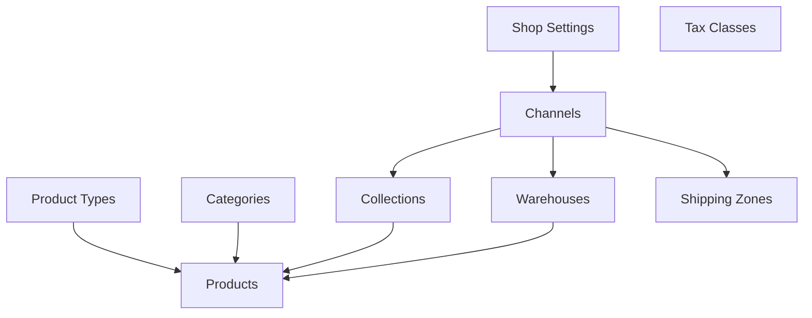

# Saleor Configurator Guide

## Table of Contents
1. [Introduction](#introduction)
2. [Configuration Rules](#configuration-rules)
3. [Entity Dependencies](#entity-dependencies)
4. [Configuration Structure](#configuration-structure)
5. [Best Practices](#best-practices)
6. [Common Patterns](#common-patterns)
7. [Troubleshooting](#troubleshooting)

## Introduction

The Saleor Configurator is a powerful tool for managing your Saleor instance configuration as code. It enables you to:

- Define your entire e-commerce setup in YAML files
- Version control your configuration
- Deploy consistent configurations across environments
- Automate repetitive setup tasks

## Configuration Rules

### 1. Order of Operations

The configurator processes entities in a specific order to respect dependencies:

```yaml
# Processing order:
1. Shop Settings
2. Product Types & Page Types (parallel)
3. Channels
4. Categories
5. Warehouses & Collections (parallel)
6. Shipping Zones & Tax Classes (parallel)
7. Products
8. Discounts & Vouchers
9. Menus & Pages
```

### 2. Naming Conventions

- **Unique Names**: All entities must have unique names within their type
- **Slugs**: Automatically generated from names unless explicitly provided
- **References**: Use exact names when referencing other entities

```yaml
# Good practice
productTypes:
  - name: "Physical Product"
    attributes:
      - name: "Size"
        inputType: DROPDOWN
        values:
          - name: "Small"
          - name: "Medium"
          - name: "Large"

products:
  - name: "T-Shirt"
    productTypeName: "Physical Product"  # Must match exactly
```

### 3. Required Fields

Each entity type has required fields that must be provided:

#### Shop Settings
- None (all fields optional)

#### Channels
- `name`
- `currencyCode`
- `defaultCountry`
- `slug`

#### Product Types
- `name`
- `attributes` (can be empty array)

#### Categories
- `name`

#### Warehouses
- `name`
- `slug`
- `address.streetAddress1`
- `address.city`
- `address.postalCode`
- `address.country`

#### Products
- `name`
- `slug`
- `productTypeName`

## Entity Dependencies

Understanding dependencies is crucial for successful configuration:



### Dependency Rules

1. **Channels** must exist before:
   - Collections (for channel listings)
   - Warehouses (for channel assignments)
   - Shipping zones (for channel assignments)
   - Products (for channel listings)

2. **Product Types** must exist before:
   - Products (products reference product types)

3. **Categories** must exist before:
   - Products (products can belong to categories)

4. **Warehouses** must exist before:
   - Product variants (for stock management)

## Configuration Structure

### Complete Example

```yaml
# saleor-config.yaml

# Global shop settings
shop:
  headerText: "Welcome to Our Store"
  description: "Your trusted e-commerce partner"
  trackInventoryByDefault: true
  defaultWeightUnit: KG
  displayGrossPrices: false

# Sales channels
channels:
  - name: "United States"
    slug: "us"
    currencyCode: "USD"
    defaultCountry: "US"
    settings:
      automaticallyConfirmAllNewOrders: false
      markAsPaidStrategy: "TRANSACTION_FLOW"
      
  - name: "European Union"
    slug: "eu"
    currencyCode: "EUR"
    defaultCountry: "DE"
    settings:
      displayGrossPrices: true

# Product structure
productTypes:
  - name: "Clothing"
    attributes:
      - name: "Material"
        inputType: DROPDOWN
        values:
          - name: "Cotton"
          - name: "Polyester"
          - name: "Wool"
      - name: "Size"
        inputType: DROPDOWN
        values:
          - name: "XS"
          - name: "S"
          - name: "M"
          - name: "L"
          - name: "XL"
      - name: "Color"
        inputType: SWATCH
        values:
          - name: "Red"
          - name: "Blue"
          - name: "Green"
          - name: "Black"
          - name: "White"

# Category hierarchy
categories:
  - name: "Apparel"
    subcategories:
      - name: "Men's Clothing"
        subcategories:
          - name: "T-Shirts"
          - name: "Jeans"
      - name: "Women's Clothing"
        subcategories:
          - name: "Dresses"
          - name: "Tops"

# Warehouse locations
warehouses:
  - name: "Main Warehouse"
    slug: "main"
    email: "warehouse@example.com"
    address:
      streetAddress1: "123 Storage Lane"
      city: "New York"
      postalCode: "10001"
      country: "US"
      
  - name: "EU Distribution Center"
    slug: "eu-dc"
    email: "eu-warehouse@example.com"
    address:
      streetAddress1: "456 Logistics Strasse"
      city: "Berlin"
      postalCode: "10115"
      country: "DE"

# Product collections
collections:
  - name: "Summer Collection"
    slug: "summer-2024"
    description: "Fresh styles for the warm season"
    channelListings:
      - channelSlug: "us"
        isPublished: true
      - channelSlug: "eu"
        isPublished: true

# Shipping configuration
shippingZones:
  - name: "United States"
    countries: ["US"]
    channels: ["us"]
    shippingMethods:
      - name: "Standard Shipping"
        type: "PRICE"
        channelListings:
          - channelSlug: "us"
            price: 5.99
            minimumOrderPrice: 0
            
      - name: "Express Shipping"
        type: "PRICE"
        channelListings:
          - channelSlug: "us"
            price: 15.99
            minimumOrderPrice: 0
            
  - name: "European Union"
    countries: ["DE", "FR", "IT", "ES", "NL", "BE", "AT"]
    channels: ["eu"]
    shippingMethods:
      - name: "EU Standard"
        type: "PRICE"
        channelListings:
          - channelSlug: "eu"
            price: 7.99

# Tax configuration
taxClasses:
  - name: "Standard Rate"
    countryRates:
      - countryCode: "US"
        rate: 8.875  # NYC tax rate
      - countryCode: "DE"
        rate: 19
      - countryCode: "FR"
        rate: 20

taxConfigurations:
  - channelSlug: "us"
    chargeTaxes: true
    displayGrossPrices: false
    pricesEnteredWithTax: false
    
  - channelSlug: "eu"
    chargeTaxes: true
    displayGrossPrices: true
    pricesEnteredWithTax: true

# Product catalog
products:
  - name: "Classic Cotton T-Shirt"
    slug: "classic-cotton-tshirt"
    description: "Comfortable everyday essential"
    productTypeName: "Clothing"
    categorySlug: "t-shirts"
    collections: ["summer-2024"]
    attributes:
      - name: "Material"
        value: "Cotton"
    channelListings:
      - channelSlug: "us"
        isPublished: true
        visibleInListings: true
        isAvailableForPurchase: true
      - channelSlug: "eu"
        isPublished: true
        visibleInListings: true
        isAvailableForPurchase: true
    variants:
      - sku: "TSHIRT-BLK-S"
        name: "Black / Small"
        attributes:
          - name: "Color"
            value: "Black"
          - name: "Size"
            value: "S"
        channelListings:
          - channelSlug: "us"
            price: 19.99
          - channelSlug: "eu"
            price: 18.99
        stocks:
          - warehouseSlug: "main"
            quantity: 100
          - warehouseSlug: "eu-dc"
            quantity: 50
```

## Best Practices

### 1. Use Environment-Specific Configurations

Create separate configuration files for different environments:

```bash
configs/
├── base.yaml          # Shared configuration
├── development.yaml   # Development-specific
├── staging.yaml      # Staging-specific
└── production.yaml   # Production-specific
```

### 2. Modular Configuration

Split large configurations into logical modules:

```bash
configs/
├── shop.yaml
├── channels.yaml
├── products/
│   ├── types.yaml
│   ├── categories.yaml
│   └── catalog.yaml
├── logistics/
│   ├── warehouses.yaml
│   └── shipping.yaml
└── finance/
    ├── taxes.yaml
    └── payment.yaml
```

### 3. Validation Before Deployment

Always validate your configuration before applying:

```bash
# Dry run to check configuration
saleor-config validate --config ./configs/

# Apply configuration
saleor-config push --config ./configs/
```

### 4. Incremental Updates

When updating existing configurations:

1. Always pull current state first
2. Make incremental changes
3. Test in staging environment
4. Apply to production

```bash
# Pull current configuration
saleor-config pull --output ./current-config.yaml

# Compare with your changes
diff current-config.yaml new-config.yaml

# Apply changes
saleor-config push --config ./new-config.yaml
```

## Common Patterns

### Multi-Channel Setup

```yaml
channels:
  - name: "B2C Channel"
    slug: "b2c"
    currencyCode: "USD"
    defaultCountry: "US"
    settings:
      automaticallyConfirmAllNewOrders: true
      
  - name: "B2B Channel"
    slug: "b2b"
    currencyCode: "USD"
    defaultCountry: "US"
    settings:
      automaticallyConfirmAllNewOrders: false
      allowUnpaidOrders: true
```

### Regional Tax Configuration

```yaml
taxConfigurations:
  - channelSlug: "us"
    chargeTaxes: true
    displayGrossPrices: false
    countryExceptions:
      - countryCode: "CA"
        chargeTaxes: true
        displayGrossPrices: false
      - countryCode: "PR"
        chargeTaxes: false
```

### Tiered Shipping

```yaml
shippingMethods:
  - name: "Economy Shipping"
    type: "PRICE"
    channelListings:
      - channelSlug: "us"
        price: 5.99
        minimumOrderPrice: 0
        maximumOrderPrice: 50
        
  - name: "Free Shipping"
    type: "PRICE"
    channelListings:
      - channelSlug: "us"
        price: 0
        minimumOrderPrice: 50
```

## Troubleshooting

### Common Issues

1. **Entity Not Found Errors**
   - Check exact name matching (case-sensitive)
   - Verify entity exists before referencing
   - Check for typos in slugs

2. **Permission Errors**
   - Ensure API token has necessary permissions
   - Check channel assignments
   - Verify user roles

3. **Validation Errors**
   - Required fields are missing
   - Invalid enum values
   - Type mismatches

### Debug Mode

Enable debug logging for detailed information:

```bash
export LOG_LEVEL=debug
saleor-config push --config ./config.yaml
```

### Configuration Validation

Use the built-in validation to catch errors early:

```yaml
# Example validation error
products:
  - name: "Test Product"
    productTypeName: "NonExistent Type"  # Error: Type doesn't exist
```

### Recovery from Failed Deployments

If a deployment fails midway:

1. Check logs for the exact failure point
2. Fix the issue in your configuration
3. Re-run the deployment (idempotent operations)
4. Verify final state matches expectations

## Advanced Topics

### Custom Attributes

Define complex attribute structures:

```yaml
productTypes:
  - name: "Electronics"
    attributes:
      - name: "Technical Specifications"
        inputType: RICH_TEXT
      - name: "Warranty Period"
        inputType: DROPDOWN
        values:
          - name: "1 Year"
          - name: "2 Years"
          - name: "3 Years"
      - name: "User Manual"
        inputType: FILE
      - name: "Related Products"
        inputType: REFERENCE
        entityType: PRODUCT
```

### Bulk Operations

For large catalogs, use batch operations:

```yaml
# Generate multiple similar products
products:
  # Use templating or scripting to generate
  # repetitive configurations
```

### Integration with CI/CD

Example GitHub Actions workflow:

```yaml
name: Deploy Saleor Configuration

on:
  push:
    branches: [main]
    paths:
      - 'configs/**'

jobs:
  deploy:
    runs-on: ubuntu-latest
    steps:
      - uses: actions/checkout@v2
      
      - name: Validate Configuration
        run: |
          saleor-config validate --config ./configs/
          
      - name: Deploy to Staging
        run: |
          saleor-config push --config ./configs/staging.yaml
        env:
          SALEOR_API_URL: ${{ secrets.STAGING_API_URL }}
          SALEOR_API_TOKEN: ${{ secrets.STAGING_API_TOKEN }}
          
      - name: Deploy to Production
        if: success()
        run: |
          saleor-config push --config ./configs/production.yaml
        env:
          SALEOR_API_URL: ${{ secrets.PROD_API_URL }}
          SALEOR_API_TOKEN: ${{ secrets.PROD_API_TOKEN }}
```

## Conclusion

The Saleor Configurator provides a powerful way to manage your e-commerce infrastructure as code. By following these guidelines and best practices, you can maintain consistent, version-controlled configurations across all your environments.

For additional support:
- Check the [API Documentation](https://docs.saleor.io/docs/3.x/api-reference)
- Review example configurations in the `/examples` directory
- Submit issues on the GitHub repository 