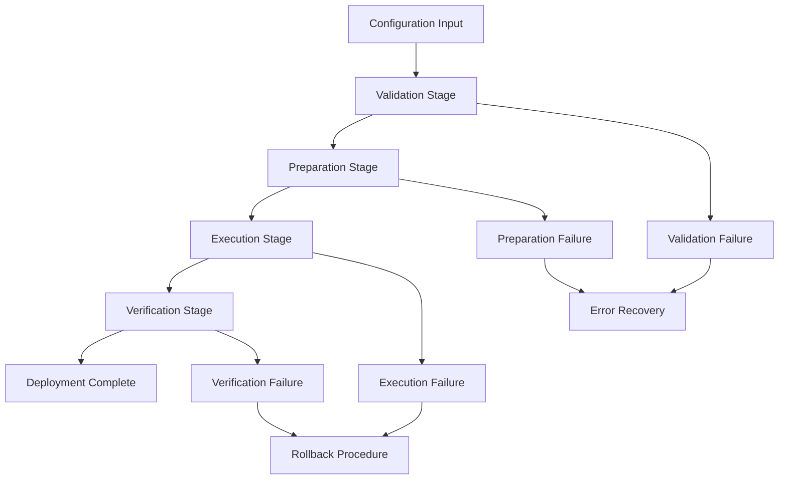

# Deployment Guide

Comprehensive guide to the Saleor Configurator deployment pipeline architecture, operational procedures, and best practices for safe configuration management.

## Pipeline Architecture Overview

### Deployment Pipeline Stages

The deployment system follows a **4-stage pipeline** with comprehensive validation and rollback capabilities:



### Core Components

**Deployment Controller**: Orchestrates the entire deployment pipeline
**Entity Services**: Handle individual entity type deployments  
**Dependency Resolver**: Manages entity relationships and deployment order
**Validation Engine**: Performs schema and business rule validation
**Execution Engine**: Performs GraphQL mutations with transaction management
**Verification System**: Validates post-deployment state consistency

## Deployment Stages Deep Dive

### Stage 1: Validation

**Purpose**: Validate configuration integrity before any changes

**Validation Types:**
1. **Schema Validation**: Zod schema compliance
2. **Business Rule Validation**: Entity-specific rules
3. **Cross-Entity Validation**: Reference integrity
4. **Permission Validation**: API access verification

**Implementation:**
```typescript
class ValidationStage {
  async execute(config: Configuration): Promise<ValidationResult> {
    // 1. Schema validation
    const schemaResult = await this.validateSchema(config);
    
    // 2. Business rule validation
    const businessResult = await this.validateBusinessRules(config);
    
    // 3. Cross-entity validation
    const crossEntityResult = await this.validateCrossEntityReferences(config);
    
    // 4. Permission validation
    const permissionResult = await this.validatePermissions(config);
    
    return this.aggregateValidationResults([
      schemaResult,
      businessResult, 
      crossEntityResult,
      permissionResult
    ]);
  }
}
```

**Validation Procedures:**
```bash
# Manual validation (dry-run)
pnpm dev deploy --url=$URL --token=$TOKEN --dry-run

# Validation with specific entities
pnpm dev deploy --url=$URL --token=$TOKEN --include=collections --dry-run

# Debug validation issues
LOG_LEVEL=debug pnpm dev deploy --url=$URL --token=$TOKEN --dry-run
```

### Stage 2: Preparation

**Purpose**: Prepare execution plan and resolve dependencies

**Preparation Steps:**
1. **Entity Dependency Resolution**: Order entities by dependencies
2. **Execution Plan Generation**: Create ordered operations list
3. **Resource Allocation**: Plan GraphQL operation batches
4. **Backup Creation**: Prepare rollback data

**Dependency Order:**
```typescript
const DEPLOYMENT_ORDER = [
  // Independent entities (no dependencies)
  ['shop'],
  ['channels', 'taxClasses', 'shippingZones'],
  
  // Level 1 dependencies
  ['productTypes', 'pageTypes', 'attributes'],
  ['warehouses', 'categories'],
  
  // Level 2 dependencies  
  ['collections', 'models'],
  
  // Level 3 dependencies
  ['products', 'menus']
];
```

**Execution Plan Example:**
```typescript
interface ExecutionPlan {
  stages: ExecutionStage[];
  rollbackPlan: RollbackOperation[];
  estimatedDuration: number;
  resourceRequirements: ResourceEstimate;
}

interface ExecutionStage {
  entities: EntityGroup[];
  dependencies: string[];
  operations: Operation[];
  canParallelize: boolean;
}
```

### Stage 3: Execution

**Purpose**: Apply configuration changes to remote Saleor instance

**Execution Strategy:**
1. **Atomic Operations**: Each entity operation is atomic
2. **Batch Processing**: Group similar operations for efficiency
3. **Transaction Management**: Handle partial failure scenarios
4. **Progress Tracking**: Monitor deployment progress

**Operation Types:**
```typescript
enum OperationType {
  CREATE = 'create',
  UPDATE = 'update',
  DELETE = 'delete',
  REORDER = 'reorder'
}

interface Operation {
  type: OperationType;
  entityType: string;
  entityId: string;
  data: any;
  dependencies: string[];
}
```

**Execution Implementation:**
```typescript
class ExecutionStage {
  async execute(plan: ExecutionPlan): Promise<ExecutionResult> {
    const results: OperationResult[] = [];
    
    for (const stage of plan.stages) {
      try {
        // Execute operations in dependency order
        const stageResults = await this.executeStage(stage);
        results.push(...stageResults);
        
        // Update progress
        this.updateProgress(results.length, plan.totalOperations);
        
      } catch (error) {
        // Trigger rollback on failure
        await this.initiateRollback(results, error);
        throw new DeploymentExecutionError(error);
      }
    }
    
    return { operations: results, success: true };
  }
}
```

### Stage 4: Verification

**Purpose**: Verify deployment completed successfully and state is consistent

**Verification Types:**
1. **Entity State Verification**: Check created/updated entities exist
2. **Relationship Verification**: Validate cross-entity references
3. **Configuration Consistency**: Compare deployed vs intended state
4. **Data Integrity**: Verify no data corruption occurred

**Verification Process:**
```typescript
class VerificationStage {
  async execute(
    originalConfig: Configuration,
    deploymentResults: ExecutionResult
  ): Promise<VerificationResult> {
    
    // 1. Re-introspect remote state
    const currentState = await this.introspectRemoteState();
    
    // 2. Compare intended vs actual state
    const stateComparison = await this.compareStates(
      originalConfig,
      currentState
    );
    
    // 3. Verify entity relationships
    const relationshipCheck = await this.verifyRelationships(currentState);
    
    // 4. Check data integrity
    const integrityCheck = await this.checkDataIntegrity(currentState);
    
    return {
      stateMatches: stateComparison.isMatch,
      relationshipsValid: relationshipCheck.isValid,
      dataIntegrityPreserved: integrityCheck.isValid,
      discrepancies: stateComparison.differences
    };
  }
}
```

## Entity Dependency Management

### Dependency Mapping

**Core Dependencies:**
```yaml
productTypes:
  dependencies: [attributes]  # Product types need attributes
  dependents: [products]     # Products depend on product types

categories:
  dependencies: []           # No dependencies
  dependents: [products, menus]  # Products and menus reference categories

collections:
  dependencies: [products, channels]  # Need products and channels
  dependents: [menus]        # Menus can reference collections

products:
  dependencies: [productTypes, categories, channels]
  dependents: [collections]  # Collections reference products
```

**Dependency Resolution Algorithm:**
```typescript
class DependencyResolver {
  resolveDependencyOrder(entities: EntityType[]): EntityGroup[] {
    const graph = this.buildDependencyGraph(entities);
    const sortedGroups = this.topologicalSort(graph);
    
    return sortedGroups.map(group => ({
      entities: group,
      canExecuteInParallel: this.canParallelizeGroup(group),
      estimatedTime: this.estimateExecutionTime(group)
    }));
  }
  
  private buildDependencyGraph(entities: EntityType[]): DependencyGraph {
    const graph = new Map<EntityType, Set<EntityType>>();
    
    for (const entity of entities) {
      const dependencies = this.getDependencies(entity);
      graph.set(entity, new Set(dependencies));
    }
    
    return graph;
  }
}
```

### Circular Dependency Detection

**Detection Algorithm:**
```typescript
class CircularDependencyDetector {
  detect(dependencies: DependencyMap): CircularDependency[] {
    const visited = new Set<string>();
    const recursionStack = new Set<string>();
    const cycles: CircularDependency[] = [];
    
    for (const [entity] of dependencies) {
      if (!visited.has(entity)) {
        this.detectCycleDFS(entity, dependencies, visited, recursionStack, cycles);
      }
    }
    
    return cycles;
  }
  
  private detectCycleDFS(
    entity: string,
    dependencies: DependencyMap,
    visited: Set<string>,
    recursionStack: Set<string>,
    cycles: CircularDependency[]
  ): void {
    visited.add(entity);
    recursionStack.add(entity);
    
    const entityDeps = dependencies.get(entity) || [];
    
    for (const dep of entityDeps) {
      if (!visited.has(dep)) {
        this.detectCycleDFS(dep, dependencies, visited, recursionStack, cycles);
      } else if (recursionStack.has(dep)) {
        // Cycle detected
        cycles.push(new CircularDependency(entity, dep));
      }
    }
    
    recursionStack.delete(entity);
  }
}
```

## Selective Deployment Architecture

### Include/Exclude Processing

**Selection Strategy:**
```typescript
class SelectiveDeploymentProcessor {
  processSelections(
    config: Configuration,
    options: SelectiveOptions
  ): FilteredConfiguration {
    
    if (options.include && options.exclude) {
      throw new CliArgumentError('Cannot specify both --include and --exclude');
    }
    
    if (options.include) {
      return this.includeOnlySelected(config, options.include);
    }
    
    if (options.exclude) {
      return this.excludeSelected(config, options.exclude);
    }
    
    return config; // Deploy everything
  }
  
  private includeOnlySelected(
    config: Configuration, 
    included: string[]
  ): FilteredConfiguration {
    const filteredConfig = new Configuration();
    
    for (const entityType of included) {
      if (config.hasEntityType(entityType)) {
        filteredConfig.addEntityType(entityType, config.getEntities(entityType));
        
        // Automatically include dependencies
        const dependencies = this.dependencyResolver.getDependencies(entityType);
        for (const dep of dependencies) {
          if (config.hasEntityType(dep)) {
            filteredConfig.addEntityType(dep, config.getEntities(dep));
          }
        }
      }
    }
    
    return filteredConfig;
  }
}
```

**Dependency Auto-inclusion:**
```bash
# When including collections, automatically includes:
# - products (collections reference products)
# - channels (collections have channel listings)
pnpm dev deploy --url=$URL --token=$TOKEN --include=collections

# Equivalent to:
pnpm dev deploy --url=$URL --token=$TOKEN --include=products,channels,collections
```

### Smart Dependency Resolution

**Implicit Dependencies:**
```typescript
interface DependencyRules {
  [entityType: string]: {
    required: string[];      // Always needed
    optional: string[];      // Include if available
    circular: string[];      // Handle circular refs
  };
}

const DEPENDENCY_RULES: DependencyRules = {
  products: {
    required: ['productTypes', 'categories'],
    optional: ['channels'],
    circular: ['collections']
  },
  collections: {
    required: ['channels'],
    optional: ['products'],  
    circular: ['products']
  }
};
```

## Error Handling and Rollback

### Failure Points and Recovery

**Validation Stage Failures:**
```typescript
class ValidationFailureHandler {
  async handleValidationFailure(
    error: ValidationError,
    config: Configuration
  ): Promise<RecoveryAction> {
    
    if (error instanceof SchemaValidationError) {
      return {
        type: 'fix_configuration',
        suggestions: this.generateSchemaFixes(error),
        canAutomaticallyFix: false
      };
    }
    
    if (error instanceof CrossReferenceError) {
      return {
        type: 'resolve_references',
        suggestions: this.generateReferenceResolution(error),
        canAutomaticallyFix: true
      };
    }
    
    return { type: 'manual_intervention', suggestions: [] };
  }
}
```

**Execution Stage Failures:**
```typescript
class ExecutionFailureHandler {
  async handleExecutionFailure(
    error: ExecutionError,
    completedOperations: Operation[]
  ): Promise<RollbackPlan> {
    
    // Create rollback plan for completed operations
    const rollbackOperations = completedOperations.reverse().map(op => 
      this.createRollbackOperation(op)
    );
    
    return {
      operations: rollbackOperations,
      estimatedTime: this.estimateRollbackTime(rollbackOperations),
      riskLevel: this.assessRollbackRisk(rollbackOperations)
    };
  }
  
  private createRollbackOperation(operation: Operation): RollbackOperation {
    switch (operation.type) {
      case OperationType.CREATE:
        return { type: 'DELETE', entityId: operation.result.id };
        
      case OperationType.UPDATE:
        return { 
          type: 'UPDATE', 
          entityId: operation.entityId,
          data: operation.previousState 
        };
        
      case OperationType.DELETE:
        return { 
          type: 'CREATE', 
          data: operation.previousState 
        };
    }
  }
}
```

### Rollback Procedures

**Automatic Rollback:**
```bash
# Rollback automatically triggered on execution failure
LOG_LEVEL=debug pnpm dev deploy --url=$URL --token=$TOKEN
# If deployment fails, automatic rollback is attempted
```

**Manual Rollback:**
```bash
# Manual rollback using backup configuration
cp config-backup.yml config.yml
pnpm dev deploy --url=$URL --token=$TOKEN --ci

# Rollback specific entities
pnpm dev deploy --url=$URL --token=$TOKEN --include=collections --rollback
```

**Rollback Verification:**
```typescript
class RollbackVerification {
  async verifyRollback(
    originalState: Configuration,
    rollbackOperations: RollbackOperation[]
  ): Promise<RollbackResult> {
    
    // Execute rollback operations
    await this.executeRollbackOperations(rollbackOperations);
    
    // Re-introspect current state
    const currentState = await this.introspectCurrentState();
    
    // Compare with original state
    const comparison = await this.compareStates(originalState, currentState);
    
    return {
      success: comparison.isMatch,
      discrepancies: comparison.differences,
      partialRollback: comparison.hasPartialChanges
    };
  }
}
```

## Performance Optimization

### Batching Strategies

**Operation Batching:**
```typescript
class BatchProcessor {
  async processBatch<T>(
    operations: Operation[],
    batchSize: number = 10
  ): Promise<BatchResult<T>> {
    
    const batches = this.chunkOperations(operations, batchSize);
    const results: T[] = [];
    
    for (const batch of batches) {
      try {
        // Execute batch operations in parallel
        const batchResults = await Promise.all(
          batch.map(op => this.executeOperation(op))
        );
        
        results.push(...batchResults);
        
        // Rate limiting between batches
        await this.rateLimitDelay();
        
      } catch (error) {
        // Handle partial batch failure
        await this.handleBatchFailure(batch, error);
      }
    }
    
    return { results, totalProcessed: operations.length };
  }
}
```

**Parallel Execution:**
```typescript
interface ParallelExecutionStrategy {
  maxConcurrency: number;
  entityGrouping: EntityGroup[];
  dependencies: DependencyMap;
}

class ParallelExecutor {
  async executeParallel(
    strategy: ParallelExecutionStrategy
  ): Promise<ExecutionResult> {
    
    const semaphore = new Semaphore(strategy.maxConcurrency);
    const results: OperationResult[] = [];
    
    for (const group of strategy.entityGrouping) {
      if (group.canExecuteInParallel) {
        // Execute entities in parallel within dependency constraints
        const groupResults = await Promise.all(
          group.entities.map(async entity => {
            await semaphore.acquire();
            try {
              return await this.executeEntity(entity);
            } finally {
              semaphore.release();
            }
          })
        );
        
        results.push(...groupResults);
      } else {
        // Execute sequentially
        for (const entity of group.entities) {
          const result = await this.executeEntity(entity);
          results.push(result);
        }
      }
    }
    
    return { operations: results, success: true };
  }
}
```

### Caching and Optimization

**GraphQL Query Optimization:**
```typescript
class QueryOptimizer {
  optimizeQueries(operations: Operation[]): OptimizedQuery[] {
    
    // Group similar operations
    const groupedOps = this.groupSimilarOperations(operations);
    
    // Create batch queries where possible
    const batchQueries = groupedOps.map(group => 
      this.createBatchQuery(group)
    );
    
    // Optimize field selection
    return batchQueries.map(query => 
      this.optimizeFieldSelection(query)
    );
  }
  
  private optimizeFieldSelection(query: GraphQLQuery): OptimizedQuery {
    // Only select fields that are needed for comparison
    const requiredFields = this.getRequiredFields(query.entityType);
    
    return {
      ...query,
      fields: requiredFields,
      estimatedPayloadSize: this.estimatePayloadSize(requiredFields)
    };
  }
}
```

## Monitoring and Logging

### Deployment Monitoring

**Progress Tracking:**
```typescript
class DeploymentMonitor {
  private progress = new EventEmitter();
  
  startMonitoring(deployment: DeploymentPlan): void {
    this.progress.emit('deployment:started', {
      totalOperations: deployment.operations.length,
      estimatedDuration: deployment.estimatedDuration
    });
  }
  
  updateProgress(completed: number, total: number): void {
    const percentage = Math.floor((completed / total) * 100);
    
    this.progress.emit('deployment:progress', {
      completed,
      total,
      percentage,
      remainingTime: this.estimateRemainingTime(completed, total)
    });
  }
  
  logOperation(operation: Operation, result: OperationResult): void {
    this.logger.info('Operation completed', {
      type: operation.type,
      entityType: operation.entityType,
      entityId: operation.entityId,
      duration: result.duration,
      success: result.success
    });
  }
}
```

**Performance Metrics:**
```typescript
interface DeploymentMetrics {
  totalDuration: number;
  operationsPerSecond: number;
  averageOperationTime: number;
  peakMemoryUsage: number;
  networkLatency: number;
  errorRate: number;
}

class MetricsCollector {
  collectMetrics(deployment: DeploymentResult): DeploymentMetrics {
    return {
      totalDuration: deployment.endTime - deployment.startTime,
      operationsPerSecond: deployment.operations.length / deployment.totalDuration,
      averageOperationTime: this.calculateAverageOperationTime(deployment.operations),
      peakMemoryUsage: deployment.peakMemoryUsage,
      networkLatency: this.calculateAverageLatency(deployment.networkCalls),
      errorRate: deployment.errors.length / deployment.operations.length
    };
  }
}
```

### Structured Logging

**Log Levels and Categories:**
```typescript
enum LogLevel {
  DEBUG = 'debug',
  INFO = 'info', 
  WARN = 'warn',
  ERROR = 'error'
}

enum LogCategory {
  VALIDATION = 'validation',
  PREPARATION = 'preparation',
  EXECUTION = 'execution',
  VERIFICATION = 'verification',
  ROLLBACK = 'rollback'
}

class DeploymentLogger {
  logStageStart(stage: DeploymentStage): void {
    this.logger.info('Stage started', {
      category: LogCategory[stage],
      stage: stage,
      timestamp: new Date().toISOString()
    });
  }
  
  logOperationResult(operation: Operation, result: OperationResult): void {
    const logLevel = result.success ? LogLevel.INFO : LogLevel.ERROR;
    
    this.logger[logLevel]('Operation result', {
      category: LogCategory.EXECUTION,
      operation: operation.type,
      entityType: operation.entityType,
      entityId: operation.entityId,
      success: result.success,
      duration: result.duration,
      error: result.error
    });
  }
}
```

## Security Considerations

### Safe Deployment Practices

**Pre-deployment Security Checks:**
```typescript
class SecurityValidator {
  async validateSecurityRequirements(
    config: Configuration,
    credentials: DeploymentCredentials
  ): Promise<SecurityValidationResult> {
    
    const checks = await Promise.all([
      this.validateTokenPermissions(credentials.token),
      this.checkConfigurationSecurity(config),
      this.validateEnvironmentSafety(credentials.url),
      this.checkForSensitiveData(config)
    ]);
    
    return {
      passed: checks.every(check => check.passed),
      issues: checks.flatMap(check => check.issues),
      recommendations: this.generateSecurityRecommendations(checks)
    };
  }
  
  private async checkForSensitiveData(config: Configuration): Promise<SecurityCheck> {
    const sensitivePatterns = [
      /api[_-]?key/i,
      /secret/i,
      /password/i,
      /token/i
    ];
    
    const configString = JSON.stringify(config);
    const issues = [];
    
    for (const pattern of sensitivePatterns) {
      if (pattern.test(configString)) {
        issues.push(`Potential sensitive data detected: ${pattern}`);
      }
    }
    
    return { passed: issues.length === 0, issues };
  }
}
```

**Production Deployment Safeguards:**
```bash
# Production deployment requires additional confirmation
pnpm dev deploy --url=$PROD_URL --token=$PROD_TOKEN
# Prompts for additional confirmation in production environments

# CI mode bypasses prompts (for automated deployments)
pnpm dev deploy --url=$PROD_URL --token=$PROD_TOKEN --ci

# Backup creation before production deployment
pnpm dev deploy --url=$PROD_URL --token=$PROD_TOKEN --backup
```

### Access Control and Auditing

**Deployment Auditing:**
```typescript
class DeploymentAuditor {
  async auditDeployment(
    deployment: DeploymentRequest,
    user: UserContext
  ): Promise<AuditRecord> {
    
    const auditRecord = {
      timestamp: new Date().toISOString(),
      user: user.id,
      environment: this.detectEnvironment(deployment.url),
      configurationHash: this.calculateConfigHash(deployment.config),
      operations: deployment.operations.map(op => ({
        type: op.type,
        entityType: op.entityType,
        entityId: op.entityId
      })),
      success: deployment.result.success,
      duration: deployment.result.duration
    };
    
    await this.storeAuditRecord(auditRecord);
    return auditRecord;
  }
  
  private detectEnvironment(url: string): Environment {
    if (url.includes('localhost') || url.includes('dev')) {
      return Environment.DEVELOPMENT;
    } else if (url.includes('staging') || url.includes('test')) {
      return Environment.STAGING;
    } else {
      return Environment.PRODUCTION;
    }
  }
}
```

## Deployment Commands Reference

### Core Deployment Commands

**Basic Deployment:**
```bash
# Deploy complete configuration
pnpm dev deploy --url=$URL --token=$TOKEN

# Deploy with confirmation prompts
pnpm dev deploy --url=$URL --token=$TOKEN --interactive

# CI mode (no prompts)
pnpm dev deploy --url=$URL --token=$TOKEN --ci
```

**Selective Deployment:**
```bash
# Deploy specific entities
pnpm dev deploy --url=$URL --token=$TOKEN --include=collections,menus

# Deploy excluding specific entities
pnpm dev deploy --url=$URL --token=$TOKEN --exclude=products,variants

# Deploy with dependency resolution
pnpm dev deploy --url=$URL --token=$TOKEN --include=products --with-dependencies
```

**Safety Options:**
```bash
# Dry run (preview changes)
pnpm dev deploy --url=$URL --token=$TOKEN --dry-run

# Create backup before deployment
pnpm dev deploy --url=$URL --token=$TOKEN --backup

# Verbose logging
pnpm dev deploy --url=$URL --token=$TOKEN --verbose

# Debug mode
LOG_LEVEL=debug pnpm dev deploy --url=$URL --token=$TOKEN
```

---

**Related Documentation:**
- [COMMANDS.md](COMMANDS.md) - Complete CLI command syntax reference
- [TROUBLESHOOTING.md](TROUBLESHOOTING.md) - Deployment error resolution procedures
- [ENTITY_REFERENCE.md](ENTITY_REFERENCE.md) - Entity dependency relationships
- [SECURITY_PATTERNS.md](SECURITY_PATTERNS.md) - Deployment security procedures  
- [CLAUDE.md](CLAUDE.md) - Main navigation hub