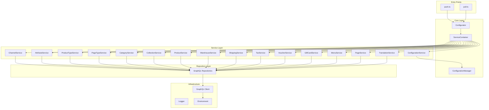
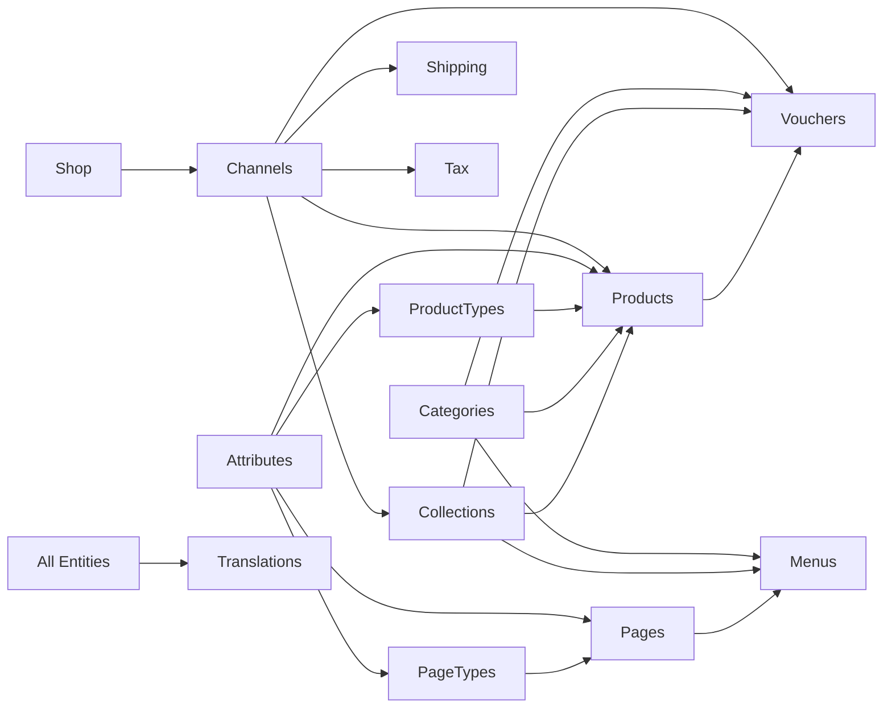

# Saleor Configurator - Complete Module Documentation

## Table of Contents
1. [Overview](#overview)
2. [Architecture](#architecture)
3. [Module Dependencies & Ordering](#module-dependencies--ordering)
4. [Core Modules](#core-modules)
5. [Entity Modules](#entity-modules)
6. [Usage Guide](#usage-guide)
7. [Configuration Schema](#configuration-schema)
8. [Examples](#examples)

## Overview

The Saleor Configurator is a TypeScript-based tool that manages and synchronizes your e-commerce configuration with a Saleor GraphQL backend. It follows a declarative approach where you define your desired state in YAML, and the configurator ensures your Saleor instance matches that state.

### Key Features
- **Declarative Configuration**: Define your entire e-commerce setup in YAML
- **Idempotent Operations**: Safe to run multiple times
- **Dependency Management**: Automatically handles entity dependencies
- **Type Safety**: Full TypeScript support with runtime validation
- **Modular Architecture**: Clean separation of concerns

## Architecture



## Module Dependencies & Ordering

The configurator processes modules in a specific order to respect dependencies:

### Bootstrap Order

1. **Initial Phase** (Foundation)
   - Shop Settings
   - Channels
   - Warehouses
   - Attributes

2. **Secondary Phase** (Type Definitions)
   - Page Types
   - Product Types
   - Tax Classes

3. **Tertiary Phase** (Content Structure)
   - Categories
   - Collections
   - Products
   - Pages
   - Menus

4. **Quaternary Phase** (Commerce Features)
   - Shipping Zones
   - Tax Configurations
   - Vouchers
   - Gift Cards
   - Translations

### Dependency Graph



## Core Modules

### 1. Configuration Service (`src/modules/config/`)
**Purpose**: Manages configuration loading, validation, and persistence.

**Key Components**:
- `ConfigurationService`: Orchestrates config operations
- `YamlConfigurationManager`: Handles YAML file I/O
- `schema.ts`: Zod schema for validation

**Usage**:
```typescript
// Configuration is automatically loaded from YAML
const config = await configService.loadConfiguration();
```

### 2. Service Container (`src/core/service-container.ts`)
**Purpose**: Dependency injection container that wires all services together.

**Key Features**:
- Creates all repository instances
- Instantiates services with proper dependencies
- Provides a unified interface for the configurator

### 3. Configurator (`src/core/configurator.ts`)
**Purpose**: Main orchestrator that coordinates the bootstrap process.

**Key Methods**:
- `bootstrap()`: Runs the complete setup process
- Handles error recovery and logging

## Entity Modules

### 1. Shop Service (`src/modules/shop/`)
**Purpose**: Manages global shop settings.

**Capabilities**:
- Default mail sender configuration
- Display settings (gross/net prices)
- Inventory tracking defaults
- Digital product settings

### 2. Channel Service (`src/modules/channel/`)
**Purpose**: Manages sales channels (different storefronts, countries, currencies).

**Key Features**:
- Multi-currency support
- Country-specific settings
- Checkout configuration
- Payment settings
- Order settings

**Dependencies**: None (foundational module)

### 3. Attribute Service (`src/modules/attribute/`)
**Purpose**: Manages product and page attributes (custom fields).

**Supported Types**:
- Text (plain, rich)
- Numeric
- Boolean
- Date/DateTime
- Dropdown/Multiselect
- File uploads
- References to other entities
- Swatch (for colors)

**Dependencies**: None (foundational module)

### 4. Product Type Service (`src/modules/product-type/`)
**Purpose**: Defines product schemas with attributes and variants.

**Key Features**:
- Attribute assignment
- Variant attributes
- Product attributes
- Type-specific settings

**Dependencies**: Attributes

### 5. Page Type Service (`src/modules/page-type/`)
**Purpose**: Defines page content schemas.

**Key Features**:
- Attribute assignment for custom page fields
- Content structuring

**Dependencies**: Attributes

### 6. Category Service (`src/modules/category/`)
**Purpose**: Manages product categorization hierarchy.

**Key Features**:
- Nested categories
- SEO settings
- Slug management

**Dependencies**: None

### 7. Collection Service (`src/modules/collection/`)
**Purpose**: Manages product collections for merchandising.

**Key Features**:
- Manual product curation
- Channel-specific visibility
- Publication rules

**Dependencies**: Channels

### 8. Product Service (`src/modules/product/`)
**Purpose**: Manages products and variants.

**Key Features**:
- Multi-variant products
- Attribute values
- Channel listings with pricing
- Inventory tracking
- Media management
- SEO optimization

**Dependencies**: 
- Channels
- Product Types
- Categories
- Collections
- Attributes

### 9. Warehouse Service (`src/modules/warehouse/`)
**Purpose**: Manages inventory locations.

**Key Features**:
- Multiple warehouse support
- Address management
- Stock allocation strategies

**Dependencies**: None

### 10. Shipping Service (`src/modules/shipping/`)
**Purpose**: Manages shipping zones and methods.

**Key Features**:
- Geographic zones
- Multiple shipping methods per zone
- Weight/price-based rates
- Channel-specific configuration
- Postal code rules

**Dependencies**: Channels

### 11. Tax Service (`src/modules/tax/`)
**Purpose**: Manages tax configuration.

**Key Features**:
- Tax classes
- Country-specific rates
- Channel-specific tax settings
- Tax calculation strategies

**Dependencies**: Channels

### 12. Voucher Service (`src/modules/voucher/`)
**Purpose**: Manages discount vouchers and sales.

**Key Features**:
- Percentage/fixed amount discounts
- Product/category/collection specific
- Usage limits
- Date ranges
- Channel-specific

**Dependencies**: 
- Channels
- Categories
- Collections
- Products

### 13. Gift Card Service (`src/modules/gift-card/`)
**Purpose**: Manages gift cards.

**Key Features**:
- Individual card creation
- Bulk generation
- Expiry dates
- Balance tracking
- Tag-based organization

**Dependencies**: None

### 14. Menu Service (`src/modules/menu/`)
**Purpose**: Manages navigation menus.

**Key Features**:
- Hierarchical menu structure
- Links to categories, collections, pages
- External URLs
- Multi-level nesting

**Dependencies**:
- Categories
- Collections
- Pages

### 15. Page Service (`src/modules/page/`)
**Purpose**: Manages content pages.

**Key Features**:
- Rich content
- Custom attributes via page types
- SEO settings
- Publication control

**Dependencies**:
- Page Types
- Attributes

### 16. Translation Service (`src/modules/translation/`)
**Purpose**: Manages multi-language content.

**Key Features**:
- Translate all entity types
- Language-specific content
- SEO translations

**Dependencies**: All other entities

## Usage Guide

### Installation

```bash
# Install dependencies
pnpm install

# Set up environment variables
cp .env.example .env
# Edit .env with your Saleor API credentials
```

### Environment Variables

```bash
# Required
GRAPHQL_ENDPOINT=https://your-store.saleor.cloud/graphql/
SALEOR_APP_TOKEN=your-app-token
LOG_LEVEL=info

# Optional
CONFIG_PATH=./config.yml  # Default: ./saleor-config.yml
```

### Basic Commands

```bash
# Pull current configuration from Saleor
pnpm run pull

# Push configuration to Saleor
pnpm run push

# Push specific configuration file
pnpm run push -- --config ./my-config.yml
```

### Workflow

1. **Initial Setup**: Pull existing configuration
   ```bash
   pnpm run pull
   ```

2. **Modify Configuration**: Edit the generated YAML file

3. **Apply Changes**: Push configuration back
   ```bash
   pnpm run push
   ```

## Configuration Schema

### Complete Example Structure

```yaml
# Shop Settings
shop:
  defaultMailSenderName: "My Store"
  defaultMailSenderAddress: "noreply@mystore.com"
  displayGrossPrices: true
  trackInventoryByDefault: true

# Channels (Required)
channels:
  - name: "United States"
    slug: "default-channel"
    currencyCode: "USD"
    defaultCountry: "US"
    stockSettings:
      allocationStrategy: "PRIORITIZE_HIGH_STOCK"

# Warehouses
warehouses:
  - name: "Main Warehouse"
    slug: "main-warehouse"
    address:
      streetAddress1: "123 Commerce St"
      city: "New York"
      countryCode: "US"
      postalCode: "10001"

# Attributes
attributes:
  - name: "Color"
    slug: "color"
    type: "PRODUCT_TYPE"
    inputType: "DROPDOWN"
    valueRequired: true
    choices:
      - { name: "Red", slug: "red" }
      - { name: "Blue", slug: "blue" }

# Product Types
productTypes:
  - name: "T-Shirt"
    slug: "t-shirt"
    hasVariants: true
    isShippingRequired: true
    productAttributes: ["material", "care-instructions"]
    variantAttributes: ["color", "size"]

# Categories
categories:
  - name: "Clothing"
    slug: "clothing"
    children:
      - name: "T-Shirts"
        slug: "t-shirts"

# Collections
collections:
  - name: "Summer Sale"
    slug: "summer-sale"
    channelListings:
      - channelSlug: "default-channel"
        isPublished: true

# Products
products:
  - name: "Cool T-Shirt"
    slug: "cool-t-shirt"
    productType: "t-shirt"
    category: "t-shirts"
    channelListings:
      - channel: "default-channel"
        isPublished: true
        visibleInListings: true
        basePrice:
          amount: 29.99
          currency: "USD"
    variants:
      - name: "Cool T-Shirt / Red / S"
        sku: "COOL-RED-S"
        attributes:
          color: "red"
          size: "s"

# Shipping
shippingZones:
  - name: "United States"
    countries: ["US"]
    channels: ["default-channel"]
    shippingMethods:
      - name: "Standard Shipping"
        type: "PRICE"
        channelListings:
          - channel: "default-channel"
            price:
              amount: 5.00
              currency: "USD"

# Tax Configuration
taxClasses:
  - name: "Standard Tax"
    rates:
      - country: "US"
        rate: 8.5

taxConfiguration:
  - channel: "default-channel"
    chargeTaxes: true
    taxCalculationStrategy: "TAX_APP"
    displayGrossPrices: true

# Vouchers
vouchers:
  - name: "WELCOME10"
    code: "WELCOME10"
    discountType: "PERCENTAGE"
    discountValue: 10
    channelListings:
      - channel: "default-channel"

# Gift Cards
giftCards:
  individual:
    - code: "GIFT-2024-001"
      initialBalance:
        amount: 100
        currency: "USD"
      isActive: true
      
  bulk:
    - count: 100
      initialBalance:
        amount: 50
        currency: "USD"
      tag: "holiday-2024"

# Menus
menus:
  - name: "Main Navigation"
    slug: "main-nav"
    items:
      - name: "Shop"
        children:
          - name: "T-Shirts"
            category: "t-shirts"
          - name: "Summer Collection"
            collection: "summer-sale"

# Pages
pages:
  - title: "About Us"
    slug: "about"
    pageTypeName: "Rich Content"
    content: "Learn about our story..."
    isPublished: true
    attributes:
      - name: "hero-image"
        value: "https://example.com/hero.jpg"

# Translations
translations:
  - entityType: "product"
    entityIdentifier: "cool-t-shirt"
    languageCode: "ES"
    translations:
      name: "Camiseta Genial"
      description: "Una camiseta muy cómoda"
```

## Examples

### Example 1: Setting Up a Multi-Channel Store

```yaml
channels:
  - name: "United States"
    slug: "us"
    currencyCode: "USD"
    defaultCountry: "US"
  
  - name: "European Union"
    slug: "eu"
    currencyCode: "EUR"
    defaultCountry: "DE"

products:
  - name: "International T-Shirt"
    slug: "intl-tshirt"
    channelListings:
      - channel: "us"
        basePrice:
          amount: 29.99
          currency: "USD"
      - channel: "eu"
        basePrice:
          amount: 24.99
          currency: "EUR"
```

### Example 2: Complex Product with Variants

```yaml
attributes:
  - name: "Size"
    slug: "size"
    type: "PRODUCT_TYPE"
    inputType: "DROPDOWN"
    choices:
      - { name: "Small", slug: "s" }
      - { name: "Medium", slug: "m" }
      - { name: "Large", slug: "l" }

productTypes:
  - name: "Clothing"
    slug: "clothing"
    hasVariants: true
    variantAttributes: ["size", "color"]
    productAttributes: ["material", "care-instructions"]

products:
  - name: "Premium Hoodie"
    slug: "premium-hoodie"
    productType: "clothing"
    attributes:
      material: "100% Organic Cotton"
      care-instructions: "Machine wash cold"
    variants:
      - name: "Premium Hoodie / Black / S"
        sku: "HOODIE-BLACK-S"
        attributes:
          color: "black"
          size: "s"
        trackInventory: true
        stocks:
          - warehouse: "main-warehouse"
            quantity: 100
```

### Example 3: Promotional Campaign

```yaml
vouchers:
  - name: "Summer Sale 20% Off"
    code: "SUMMER20"
    discountType: "PERCENTAGE"
    discountValue: 20
    startDate: "2024-06-01"
    endDate: "2024-08-31"
    usageLimit: 1000
    applyOncePerCustomer: true
    channelListings:
      - channel: "default-channel"
    categories: ["summer-clothing"]
    minCheckoutItemsQuantity: 2
```

## Best Practices

### 1. Use Meaningful Identifiers
- Use descriptive slugs that won't change
- Maintain consistent naming conventions
- Avoid special characters in slugs

### 2. Start Small
- Begin with core entities (channels, attributes, product types)
- Add products and content incrementally
- Test changes in a staging environment

### 3. Version Control
- Keep your YAML configuration in git
- Document changes in commit messages
- Use branches for major updates

### 4. Organize Large Configurations
- Split configuration into multiple files if needed
- Use YAML anchors for repeated values
- Comment complex configurations

### 5. Handle Secrets Securely
- Never commit API tokens
- Use environment variables
- Consider secret management tools

## Troubleshooting

### Common Issues

1. **"Entity not found" errors**
   - Check that referenced entities exist
   - Verify slug spelling
   - Ensure proper bootstrap order

2. **"Permission denied" errors**
   - Verify API token permissions
   - Check token hasn't expired
   - Ensure app has necessary permissions

3. **Validation errors**
   - Review the schema requirements
   - Check required fields
   - Validate data types

### Debug Mode

Enable detailed logging:
```bash
LOG_LEVEL=debug pnpm run push
```

### Getting Help

1. Check the error message carefully
2. Review the module's test files for examples
3. Examine the GraphQL schema
4. Check Saleor's documentation

## Module API Reference

For detailed API documentation of each module, refer to the TypeScript interfaces and JSDoc comments in the source code:

- Service interfaces: `src/modules/*/[module]-service.ts`
- Repository interfaces: `src/modules/*/repository.ts`
- Configuration schema: `src/modules/config/schema.ts`

Each module follows a consistent pattern:
- **Service**: Business logic and orchestration
- **Repository**: GraphQL operations
- **Types**: TypeScript interfaces

## Contributing

When adding new modules:

1. Follow the existing module structure
2. Implement both service and repository layers
3. Add comprehensive tests
4. Update the bootstrap order if needed
5. Document the module in this guide

## License

This project is licensed under the MIT License. 