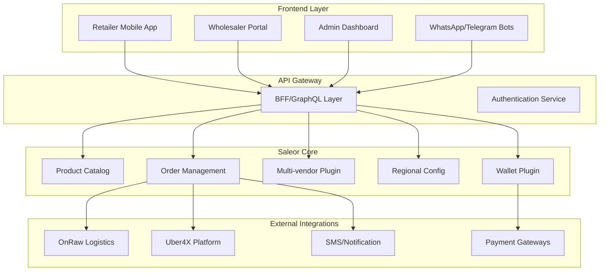

# Rida Technologies - Consolidated Saleor Implementation Analysis

## Executive Summary

Based on the discovery session transcript, Excalidraw board, and Saleor capabilities analysis, Rida Technologies is building a B2B marketplace platform with aggressive timelines and complex requirements. This document consolidates all findings and provides a clear implementation path.

## 🎯 Confirmed Business Model

### Vision Statement
**"Amazon for B2B"** - Multi-vendor marketplace for wholesalers and retailers in Sudan and Saudi Arabia, with future expansion to B2C and fintech services.

### Core Value Proposition
- First B2B delivery platform in target markets
- Multi-vendor price competition
- Integrated logistics and delivery
- Digital payment solutions for underbanked markets

## 📊 Requirements Validation Matrix

| Requirement | Transcript | Board | Saleor Support | Custom Dev | Priority |
|------------|------------|--------|----------------|------------|----------|
| B2B Marketplace | ✅ | ✅ | ✅ Supported | Minor config | MVP |
| Multi-vendor | ✅ | ✅ | ⚙️ Recipe available | Plugin needed | MVP |
| Multi-country | ✅ | ✅ | ✅ Channels | Configuration | MVP |
| Sub-regions | ✅ | ✅ | ❌ Not native | Custom logic | MVP |
| Price competition | ✅ | ✅ | ⚙️ Variants | Custom display | MVP |
| Order modification | ✅ | ❌ | ⚙️ API available | Workflow needed | MVP |
| Wallet system | ✅ | ✅ | ❌ Not native | Full custom | MVP |
| Bidding system | ✅ | ✅ | ❌ Not native | Full custom | Phase 2 |
| Logistics integration | ✅ | ✅ | ⚙️ Webhooks | Integration layer | MVP |
| Vendor hierarchy | ✅ | ❌ | ❌ Not native | Custom model | Phase 2 |

## 🏗️ Refined Technical Architecture

### System Components



### Data Model Implementation

```yaml
# Saleor Configuration Approach
Channels:
  - name: "Saudi Arabia"
    currency: "SAR"
    metadata:
      regions: ["Eastern", "Western", "Riyadh"]
      
  - name: "Sudan"
    currency: "SDG"
    metadata:
      regions: ["Khartoum", "Port Sudan", "Kassala"]

Products:
  - Base product (e.g., "Sugar 25kg")
  - Variants per vendor with:
    - SKU: vendor-specific
    - Price: vendor-specific
    - Stock: from vendor warehouse
    - Metadata: 
      - vendor_id
      - min_order_quantity
      - delivery_time

Warehouses:
  - One per vendor location
  - Linked to shipping zones
  - Stock tracking per warehouse

User Types:
  - Retailers (buyers)
  - Wholesalers (vendors) 
  - Platform admins
  - Drivers (external system)
```

## 🚀 Revised Implementation Timeline

### Week 1-2: Foundation & Setup
- [x] Saleor environment setup
- [ ] Channel configuration (SA, Sudan)
- [ ] Basic product type structure
- [ ] Vendor user role creation
- [ ] Initial warehouse setup

### Week 3-4: Core Development
- [ ] Multi-vendor plugin development
- [ ] Sub-region metadata system
- [ ] Basic wallet plugin
- [ ] Order modification workflow
- [ ] Vendor catalog management UI

### Week 5-6: Integration & MVP
- [ ] OnRaw webhook integration
- [ ] Basic payment processing
- [ ] Mobile app API endpoints
- [ ] Testing with pilot vendors
- [ ] Soft launch preparation

### Week 7-8: Refinement & Launch
- [ ] Performance optimization
- [ ] Bug fixes from pilot
- [ ] Documentation
- [ ] Training materials
- [ ] Production deployment

## 💡 Critical Implementation Decisions

### 1. Multi-Vendor Product Model
**Decision**: Use Product Variants for vendor offers
```graphql
Product: "Sugar 25kg"
├── Variant 1: RidaMart - $10
├── Variant 2: Vendor A - $9
└── Variant 3: Vendor B - $11
```
**Rationale**: Leverages existing Saleor structure, enables price comparison

### 2. Regional Configuration
**Decision**: Use Channel metadata + custom service
```python
# Custom service for sub-regional logic
class RegionalService:
    def get_available_products(channel, region, sub_region):
        # Filter products based on vendor coverage
        # Apply regional pricing rules
        # Check delivery availability
```
**Rationale**: Maintains Saleor structure while adding needed flexibility

### 3. Wallet Implementation
**Decision**: Custom payment plugin with balance tracking
```python
class WalletPlugin(BasePlugin):
    - Track user balances
    - Handle top-ups from external wallets
    - Process internal transfers
    - Generate transaction history
```
**Rationale**: Required for Sudan market, no suitable existing solution

### 4. Order Modification Flow
**Decision**: State machine with approval workflow
```
Order Placed → Vendor Review → Price/Availability Change? 
    ↓ Yes                          ↓ No
Buyer Approval Required        Process Order
    ↓                              ↓
Accept/Reject               Fulfillment
```
**Rationale**: Handles hyperinflation and inventory issues

## 🔑 Success Factors & Risks

### Critical Success Factors
1. **Vendor onboarding simplicity** - Must be easy for non-technical users
2. **Mobile-first design** - Primary interface for all users
3. **Offline capability** - Handle connectivity issues
4. **Price flexibility** - Daily price updates capability
5. **Local payment support** - Wallet system operational

### Risk Mitigation

| Risk | Impact | Mitigation |
|------|--------|------------|
| 6-week timeline | High | Focus on true MVP, defer nice-to-haves |
| Sudan connectivity | High | Offline-capable apps, SMS fallback |
| Hyperinflation | High | Price modification workflow, daily updates |
| Vendor adoption | Medium | Simple onboarding, training support |
| Technical complexity | Medium | Use Saleor defaults where possible |

## 📋 Action Items & Next Steps

### Immediate Actions (This Week)
1. ✅ Sign Saleor Accelerator contract
2. ⏳ Contact Mirumee for storefront partnership
3. ⏳ Set up development environment
4. ⏳ Configure initial channels and products
5. ⏳ Begin vendor plugin development

### Week 2 Priorities
1. Complete sub-region configuration system
2. Implement basic wallet structure
3. Create vendor management interface
4. Set up OnRaw integration endpoint
5. Begin mobile app development

### Dependencies to Resolve
- [ ] OnRaw API documentation and credentials
- [ ] Payment gateway selection for Saudi Arabia
- [ ] Sudan wallet provider partnerships
- [ ] SMS gateway for notifications
- [ ] Hosting infrastructure decisions

## 🎯 MVP Definition

### Minimum Viable Product (6 weeks)
✅ **Included:**
- Single country operation (Saudi or Sudan)
- 5-10 wholesalers
- 20-30 retailers
- Basic product catalog (FMCG)
- Order placement and tracking
- Vendor order management
- Basic wallet payments
- OnRaw logistics integration

❌ **Deferred to Phase 2:**
- Bidding system
- Multi-country operation
- Advanced analytics
- WhatsApp/Telegram bots
- Vendor hierarchy
- Subscription models
- B2C marketplace

## 📊 Metrics for Success

### Week 6 Success Criteria
- [ ] Platform deployed and accessible
- [ ] 5+ vendors onboarded
- [ ] 20+ retailers registered
- [ ] 10+ successful test orders
- [ ] Payment processing functional
- [ ] Delivery integration working

### Month 3 Targets
- [ ] 50+ active vendors
- [ ] 500+ active retailers
- [ ] 1000+ orders processed
- [ ] Second country launch
- [ ] Bidding system operational

## 🔄 Continuous Improvement Plan

### Post-MVP Iterations
1. **Month 2**: Bidding system, enhanced analytics
2. **Month 3**: Second country, vendor hierarchy
3. **Month 4**: WhatsApp/Telegram integration
4. **Month 5**: B2C marketplace features
5. **Month 6**: Advanced logistics optimization

## 📝 Final Recommendations

### Do's ✅
1. **Leverage Saleor's existing features** wherever possible
2. **Start simple** with vendor management
3. **Focus on mobile experience** from day one
4. **Build flexible pricing system** for daily updates
5. **Prioritize vendor onboarding** experience

### Don'ts ❌
1. **Don't over-engineer** the MVP
2. **Don't build custom** what Saleor provides
3. **Don't delay** critical integrations
4. **Don't ignore** offline scenarios
5. **Don't underestimate** training needs

## 🚀 Conclusion

Rida Technologies' B2B marketplace vision is achievable with Saleor, but requires strategic customization and aggressive execution. The 6-week timeline demands laser focus on core features, with a clear path for post-MVP enhancements. Success depends on:

1. **Effective use of Saleor's marketplace capabilities**
2. **Strategic custom development** (wallet, sub-regions, order modifications)
3. **Strong integration layer** for logistics and payments
4. **Mobile-first user experience**
5. **Rapid iteration based on user feedback**

With proper execution and the support structure outlined in this document, Rida can establish itself as the leading B2B marketplace platform in its target markets.