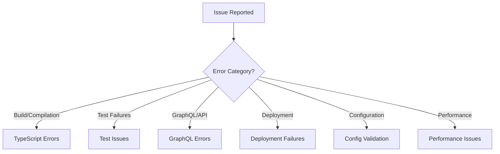

# Troubleshooting Guide

Comprehensive troubleshooting procedures for the Saleor Configurator with systematic decision trees, diagnostic commands, and error recovery procedures.

## Quick Reference

### Immediate Diagnostic Commands

**System Health Check:**
```bash
# Complete validation pipeline
pnpm check && pnpm build && pnpm test && npx tsc --noEmit

# API connectivity test
pnpm dev diff --url=$TEST_URL --token=$TEST_TOKEN --dry-run
```

**GraphQL Diagnostics:**
```bash
# Test permissions
pnpm dev introspect --url=$URL --token=$TOKEN --include=shop

# Schema compatibility check
pnpm fetch-schema && pnpm build

# Debug mode analysis
LOG_LEVEL=debug pnpm dev diff --url=$URL --token=$TOKEN
```

## Troubleshooting Decision Tree

### Systematic Problem Diagnosis

**Step 1: Identify Problem Category**


### GraphQL Error Resolution Tree
```
GraphQL Error
├── Authentication (401/403)
│   ├── Check token validity in Saleor dashboard
│   ├── Verify app permissions (all permissions required)
│   └── Test with: pnpm dev diff --url=$URL --token=$TOKEN
├── Network Issues (5xx, timeouts)
│   ├── Check Saleor instance availability
│   ├── Verify URL format (must end with /graphql/)
│   └── Test connectivity: curl -I $URL
├── Schema Validation (400)
│   ├── Check Saleor version compatibility (3.20+)
│   ├── Run: pnpm fetch-schema
│   └── Verify GraphQL query syntax
└── Permission Errors (specific operations)
    ├── Check entity-specific permissions
    ├── Verify app has manage permissions
    └── Test with minimal configuration
```

### Deployment Failure Resolution Tree
```
Deployment Failure
├── Validation Stage Failure
│   ├── Schema validation errors → Check Zod schema definitions
│   ├── Entity relationship errors → Verify cross-entity references
│   └── Configuration format errors → Validate YAML syntax
├── Preparation Stage Failure
│   ├── Dependency resolution errors → Check entity dependencies
│   ├── Execution order issues → Review entity relationships
│   └── Resource allocation errors → Check GraphQL complexity
├── Execution Stage Failure
│   ├── GraphQL mutation errors → Check individual entity operations
│   ├── Transaction failures → Review batch operations
│   └── Rollback triggered → Analyze partial deployment state
└── Verification Stage Failure
    ├── Entity state inconsistency → Manual verification required
    ├── Relationship validation errors → Check cross-entity references
    └── Configuration mismatch → Run introspect to compare
```

### Test Failure Resolution Tree
```
Test Failure
├── Unit Test Failures
│   ├── Mock Interface Errors → Use actual service types
│   ├── Service Dependency Issues → Check service container mocks
│   └── Validation Logic Errors → Review business rules
├── Integration Test Failures
│   ├── Cross-Entity Reference Errors → Check entity relationships
│   ├── Configuration Validation Errors → Review schema definitions
│   └── End-to-End Flow Issues → Check complete workflows
├── TypeScript Compilation Errors
│   ├── Type Safety Issues → Remove `as any` usage
│   ├── Import/Export Errors → Check module paths
│   └── Generic Constraint Errors → Review type definitions
└── Biome Linting Errors
    ├── Code Style Issues → Run: pnpm check:fix
    ├── Unused Import Errors → Clean up imports
    └── No Explicit Any Errors → Use proper types
```

### Performance Issue Resolution Tree
```
Performance Issues
├── GraphQL Query Performance
│   ├── Large payload → Use selective field queries
│   ├── N+1 queries → Implement batching
│   └── Timeout errors → Add pagination
├── Memory Usage
│   ├── Context window overflow → Use Serena symbolic tools
│   ├── Large file processing → Implement streaming
│   └── Memory leaks → Review async operations
├── Development Performance
│   ├── Slow test execution → Use selective testing
│   ├── Build performance → Check TypeScript configuration
│   └── Tool performance → Prefer Serena over Bash tools
└── Deployment Performance
    ├── Large configuration → Use selective deployment
    ├── Network latency → Implement retry mechanisms
    └── Batch operation limits → Reduce batch sizes
```

## Quick Diagnostic Commands

### General Health Check

**Complete System Validation:**
```bash
# Full quality assurance pipeline
pnpm check && pnpm build && pnpm test && npx tsc --noEmit

# API connectivity test
pnpm dev diff --url=$TEST_URL --token=$TEST_TOKEN --dry-run
```

### GraphQL Specific Diagnostics

**Permission Testing:**
```bash
# Basic permission test
pnpm dev introspect --url=$URL --token=$TOKEN --include=shop

# Schema compatibility check
pnpm fetch-schema && pnpm build

# Debug mode analysis
LOG_LEVEL=debug pnpm dev diff --url=$URL --token=$TOKEN
```

### Entity Specific Testing

**Selective Entity Testing:**
```bash
# Test specific entity operations
pnpm dev diff --url=$URL --token=$TOKEN --include=collections

# Test deployment for single entity
pnpm dev deploy --url=$URL --token=$TOKEN --include=shop --dry-run

# Check entity relationships
pnpm dev diff --url=$URL --token=$TOKEN --include=categories,products
```

### Connection Troubleshooting

**Basic Connectivity:**
```bash
# Test HTTP connectivity
curl -I $SALEOR_URL

# Minimal API test
pnpm dev introspect --url=$URL --token=$TOKEN --include=shop --quiet
```

**Permission Verification:**
```bash
# Test read permissions
pnpm dev introspect --url=$URL --token=$TOKEN --include=shop

# Test write permissions (safe)
echo "shop:" > minimal-config.yml
echo "  defaultMailSenderName: Test" >> minimal-config.yml
pnpm dev deploy --url=$URL --token=$TOKEN --config=minimal-config.yml --dry-run
```

**Configuration Validation:**
```bash
# Validate configuration syntax
pnpm dev deploy --url=$URL --token=$TOKEN --dry-run --quiet

# Check specific entity validation
pnpm dev deploy --url=$URL --token=$TOKEN --include=collections --dry-run
```

## Error Recovery Procedures

### Partial Deployment Recovery

**Scenario**: Deployment fails after some entities are successfully deployed

**Recovery Steps:**

1. **Assess Current State:**
   ```bash
   pnpm dev diff --url=$URL --token=$TOKEN
   ```
   
2. **Identify Successfully Deployed Entities:**
   - Review deployment pipeline logs
   - Note which entities completed successfully
   - Identify where deployment stopped

3. **Clean Recovery Approach:**
   ```bash
   # Remove local config to get fresh state
   rm config.yml
   
   # Introspect current remote state  
   pnpm dev introspect --url=$URL --token=$TOKEN
   
   # Manually apply remaining changes
   # Edit config.yml to add only failed entities
   
   # Deploy remaining entities
   pnpm dev deploy --url=$URL --token=$TOKEN --include=failed-entities
   ```

4. **Verification:**
   ```bash
   # Final state check
   pnpm dev diff --url=$URL --token=$TOKEN
   # Should show no differences
   ```

### Schema Validation Error Recovery

**Scenario**: Configuration fails Zod validation

**Diagnosis Steps:**

1. **Identify Validation Error:**
   ```bash
   # Validation errors are usually detailed in output
   pnpm dev deploy --url=$URL --token=$TOKEN --dry-run
   ```

2. **Field-by-Field Analysis:**
   ```typescript
   // Common validation issues:
   // - Missing required fields (slug, name)
   // - Invalid enum values
   // - Type mismatches (string vs number)
   // - Format issues (URL, email)
   ```

3. **Schema Reference Check:**
   ```bash
   # Check current schema definitions
   cat SCHEMA.md | grep -A 10 "EntityType"
   ```

**Resolution Approach:**
```yaml
# Example: Collection validation error
collections:
  - name: "Test Collection"           # Required
    slug: "test-collection"           # Required for collections
    products: ["product-slug"]        # Must reference existing products
    channelListings:                  # Correct structure
      - channel: "default-channel"    # Must reference existing channel
        isPublished: true             # Boolean, not string
```

### Cross-Entity Reference Resolution

**Scenario**: Entity references another entity that doesn't exist

**Resolution Strategy:**

1. **Identify Dependencies:**
   ```bash
   # Use dependency mapping
   grep -r "reference-name" config.yml
   ```

2. **Verify Referenced Entities:**
   ```bash
   # Check if referenced entity exists in remote
   pnpm dev introspect --url=$URL --token=$TOKEN --include=referenced-entity
   ```

3. **Resolution Options:**
   - **Option A**: Create missing referenced entity first
   - **Option B**: Remove invalid reference
   - **Option C**: Update reference to existing entity

4. **Deploy in Dependency Order:**
   ```bash
   # Deploy dependencies first
   pnpm dev deploy --url=$URL --token=$TOKEN --include=channels,categories
   
   # Then deploy entities that reference them  
   pnpm dev deploy --url=$URL --token=$TOKEN --include=collections,menus
   ```

### Network/GraphQL Recovery

**Scenario**: Network timeouts or GraphQL service unavailable

**Recovery Procedure:**

1. **Verify Service Availability:**
   ```bash
   curl -I https://your-store.saleor.cloud/graphql/
   ```

2. **Test with Minimal Operation:**
   ```bash
   pnpm dev introspect --url=$URL --token=$TOKEN --include=shop
   ```

3. **Retry with Exponential Backoff:**
   ```bash
   # Wait increasing intervals between retries
   sleep 5  && pnpm dev deploy ... || \
   sleep 10 && pnpm dev deploy ... || \
   sleep 30 && pnpm dev deploy ...
   ```

4. **Fallback to Selective Operations:**
   ```bash
   # Deploy entities one at a time
   pnpm dev deploy --url=$URL --token=$TOKEN --include=shop
   pnpm dev deploy --url=$URL --token=$TOKEN --include=channels
   # Continue for each entity type
   ```

## Common Error Scenarios

### Authentication Errors

**Error**: `Authentication failed` or `Forbidden`

**Resolution**:
1. Verify token in Saleor dashboard
2. Check app permissions (requires ALL permissions)
3. Test with minimal operation:
   ```bash
   pnpm dev introspect --url=$URL --token=$TOKEN --include=shop
   ```

### Configuration Validation Errors

**Error**: `Validation failed` with field-specific errors

**Resolution**:
1. Check required fields are present
2. Verify enum values match schema
3. Validate entity references exist
4. Test configuration syntax:
   ```bash
   pnpm dev deploy --url=$URL --token=$TOKEN --dry-run
   ```

### Entity Reference Errors

**Error**: `Referenced entity not found`

**Resolution**:
1. Check dependency order
2. Verify referenced entities exist in remote
3. Deploy dependencies first:
   ```bash
   pnpm dev deploy --url=$URL --token=$TOKEN --include=dependencies
   ```

### Network/Timeout Errors

**Error**: `Network timeout` or `Service unavailable`

**Resolution**:
1. Check Saleor instance status
2. Verify network connectivity
3. Retry with smaller batch sizes
4. Use selective operations for large deployments

## Migration Issues

### Version Compatibility

**Saleor Version Compatibility:**
| Saleor | Configurator | Status |
|--------|-------------|---------|
| 3.20.x | 0.14.x+ | ✅ Current |
| 3.19.x | 0.12.x-0.14.x | ⚠️ Legacy |
| 3.18.x | 0.10.x-0.12.x | ❌ Deprecated |

### Breaking Changes

**Common Breaking Changes:**
- **Entity Identification**: Categories/channels now use slug instead of name
- **Required Fields**: New required fields may break old configs
- **Type Changes**: Field type changes require data migration

**Migration Process:**
```bash
# 1. Backup current state
pnpm dev introspect --url=$URL --token=$TOKEN
cp config.yml config.backup.yml

# 2. Update configurator version
npm update @saleor/configurator

# 3. Test with new version
pnpm dev diff --url=$URL --token=$TOKEN

# 4. Fix any validation errors
# Review error messages and update config accordingly

# 5. Deploy updated configuration
pnpm dev deploy --url=$URL --token=$TOKEN
```

### Token Storage

**Secure Token Management:**
```bash
# Environment variables (recommended)
export SALEOR_TOKEN="your-token"
export SALEOR_URL="https://store.saleor.cloud/graphql/"

# Never commit tokens
echo "SALEOR_TOKEN=token" >> .env.local
echo ".env.local" >> .gitignore
```

---

**Related Documentation:**
- [COMMANDS.md](COMMANDS.md) - Complete command syntax reference
- [ENTITY_REFERENCE.md](ENTITY_REFERENCE.md) - Entity identification and patterns
- [CLAUDE.md](CLAUDE.md) - Main navigation hub