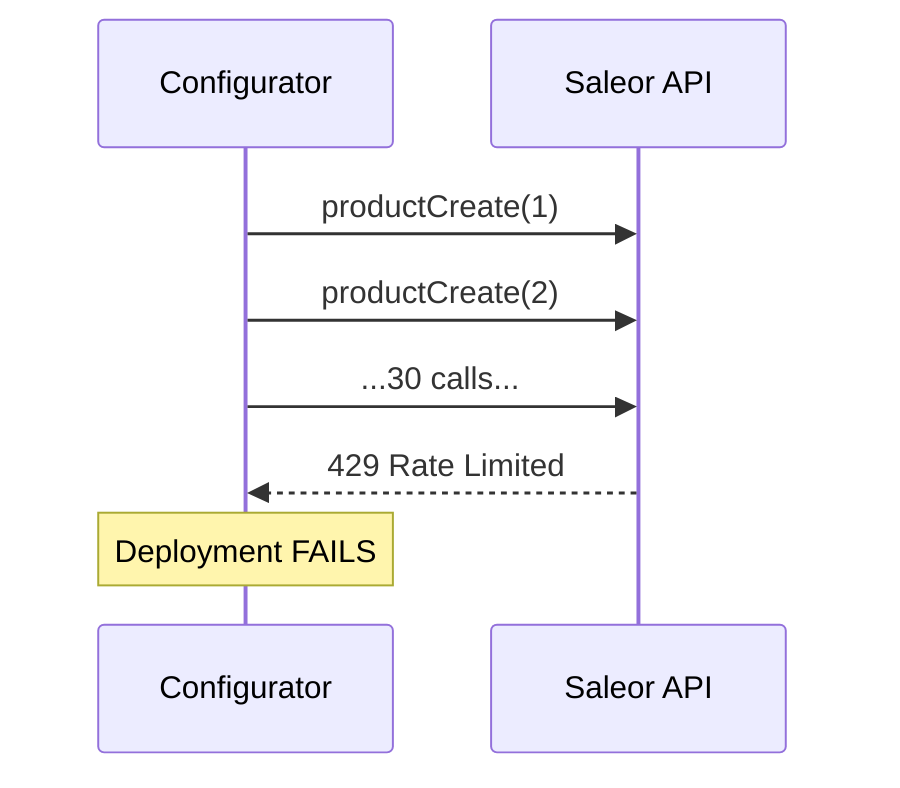
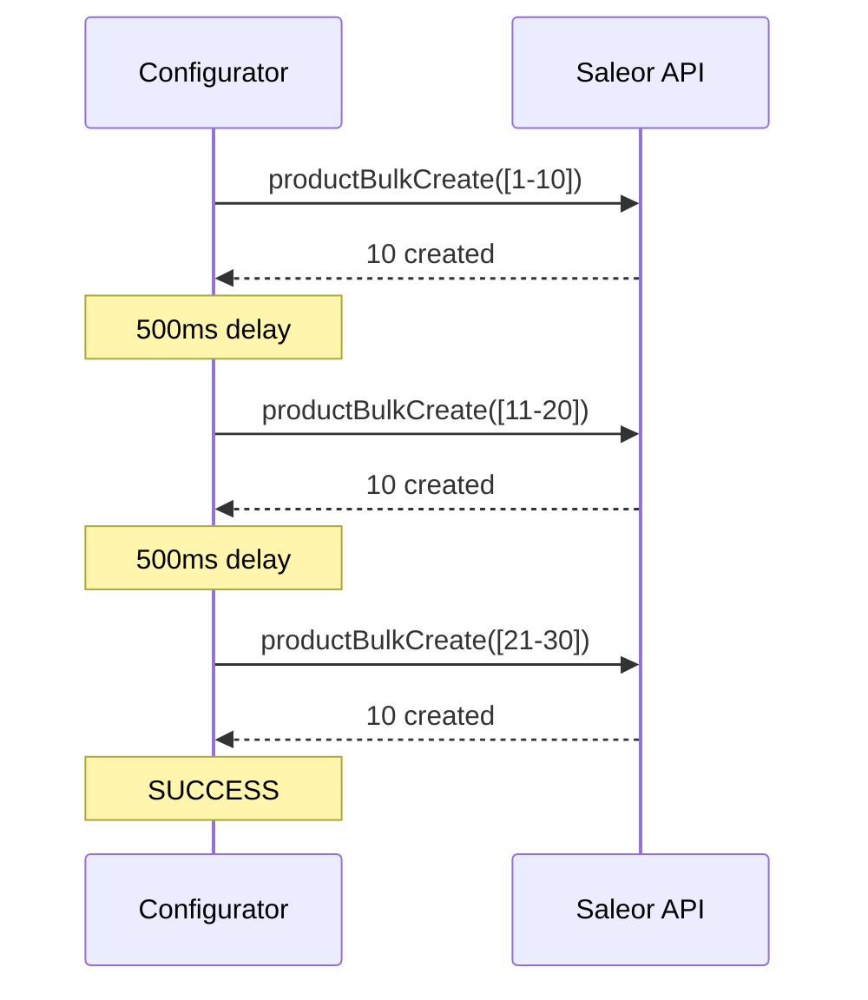

# ADR 001: Bulk Mutations Optimization

## TL;DR

Replaced individual GraphQL mutations with Saleor's native bulk operations and chunked processing to solve rate limiting and slow deployments. **Result**: 95% faster deployments (5.7min → 18s), 89% fewer API calls, zero rate limit errors.

## Status

**Accepted** - 2025-11-12

## Glossary

| Term | Definition |
|------|------------|
| **N+1 Problem** | When processing N entities requires N separate API calls, causing linear scaling issues |
| **Bulk Mutation** | Single GraphQL mutation that creates/updates multiple entities at once (e.g., `productBulkCreate`) |
| **Chunked Processing** | Breaking large batches into smaller chunks (default: 10 items) with delays between them |
| **Rate Limiting** | Server rejecting requests (HTTP 429) when call volume exceeds allowed threshold |
| **O(n) → O(1)** | Reducing API calls from linear (proportional to entity count) to constant (fixed regardless of count) |

## Context

### Problem

Saleor Configurator deployments were failing due to an N+1 mutation pattern where each entity required an individual GraphQL mutation:

- 30 products = 30 `productCreate` mutations
- 50 attributes = 50 `attributeCreate` mutations
- 60 variants = 60 `productVariantCreate` mutations
- **Total**: 170+ API calls for a modest configuration

### Symptoms

| Issue | Impact |
|-------|--------|
| Rate Limiting | 50+ HTTP 429 errors per deployment |
| Slow Deployments | 5.7 minutes for 30 products |
| Low Reliability | ~60% deployment success rate |
| Poor Scalability | Larger configurations failed completely |

## Decision

We chose a **two-layer optimization** using bulk mutations with chunked processing.

### Layer 1: Bulk Mutations

Replace individual mutations with Saleor's native bulk GraphQL operations:

| Instead of | Use |
|------------|-----|
| N × `productCreate` | `productBulkCreate` |
| N × `attributeCreate` | `attributeBulkCreate` |
| N × `productVariantCreate` | `productVariantBulkCreate` |

**Impact**: Reduces O(n) → O(1) API calls per entity type

### Layer 2: Chunked Processing

For entities without bulk APIs, process in configurable chunks with delays:

- **Chunk size**: 10 items (default)
- **Delay**: 500ms between chunks
- **Utility**: `processInChunks()` in `src/lib/utils/chunked-processor.ts`

**Impact**: Eliminates rate limiting, enables partial success handling

## Options Considered

| Option | API Calls | Complexity | Verdict |
|--------|-----------|------------|---------|
| Increase Rate Limits | N | Low | Rejected - treats symptom, not root cause |
| Queue-Based (Redis) | N | High | Rejected - overengineered, still N calls |
| Parallel + Semaphore | N | Medium | Rejected - reduces time, not calls |
| GraphQL Batching | N | Medium | Rejected - server still executes N mutations |
| **Bulk + Chunking** | **N/10** | **Low** | **Selected** - addresses root cause |

## Processing Strategies

### Strategy A: Bulk Mutations

Used when Saleor provides native bulk APIs.

```typescript
// Single API call for all products
await repository.bulkCreateProducts({
  products: allProducts
});
```

### Strategy B: Chunked Individual

Used when no bulk API exists. Processes items in chunks with delays.

```typescript
const { successes, failures } = await processInChunks(
  items,
  async (chunk) => Promise.all(chunk.map(item => createEntity(item))),
  { chunkSize: 10, delayMs: 500 }
);
```

## Entity Coverage

| Entity | Strategy | GraphQL Operation |
|--------|----------|-------------------|
| Products | Bulk Mutation | `productBulkCreate` |
| Product Variants | Bulk Mutation | `productVariantBulkCreate`, `productVariantBulkUpdate` |
| Attributes | Bulk Mutation | `attributeBulkCreate`, `attributeBulkUpdate` |
| Product Types | Chunked Individual | `productTypeCreate` |
| Collections | Chunked Individual | `collectionCreate` |
| Warehouses | Chunked Individual | `createWarehouse` |
| Shipping Zones | Batched Individual | `createShippingZone` |
| Channels | Batched Individual | `createChannel` |
| Categories | Batched Individual | `createCategory` |
| Menus | Batched Individual | `createMenu` |
| Models (Pages) | Batched Individual | `createPage` |
| Tax Classes | Batched Individual | `taxClassCreate` |
| Page Types | Individual | `pageTypeCreate` |
| Shop | Direct Update | Shop mutations |

## Architecture

### Before: Sequential Individual Mutations



### After: Bulk Mutations with Chunking



## Results

**Test Configuration**: 30 products, 20 product types, 50 attributes, 60 variants

| Metric | Before | After | Improvement |
|--------|--------|-------|-------------|
| API Calls | 170+ | 18 | -89% |
| Deployment Time | 5.7 min | 18 sec | -95% |
| Rate Limit Errors | 50+ | 0 | -100% |

## Tradeoffs

| Tradeoff | Impact | Mitigation |
|----------|--------|------------|
| Chunk delay overhead | +500ms per chunk | Negligible vs 95% time reduction |
| All-or-nothing chunk failures | 10-item blast radius | Acceptable vs cascade failures |
| Code complexity | 199 lines of utility | Reusable, well-tested (22 tests) |

## References

- [Saleor Bulk Operations API](https://docs.saleor.io/docs/3.x/api-reference/products/mutations/product-bulk-create)
- [N+1 Query Problem](https://stackoverflow.com/questions/97197/what-is-the-n1-selects-problem)
- [HTTP 429 Rate Limiting](https://developer.mozilla.org/en-US/docs/Web/HTTP/Status/429)
